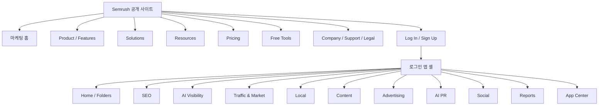
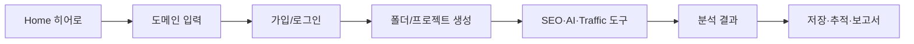
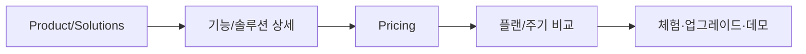

# Semrush 프론트엔드 UI/UX 페이지 인벤토리

> 조사 기준일: 2026-07-27 (Asia/Seoul)  
> 기준 도메인: `https://www.semrush.com`  
> 조사 방법: 공개 사이트 DOM/반응형 확인, 공개 XML 사이트맵·`robots.txt` 대조, 로그인된 Semrush 앱의 실제 전역/좌측 내비게이션 확인  
> 문서 목적: Semrush의 프론트엔드 정보 구조, 페이지 유형, 공통 UI 패턴과 주요 사용자 흐름을 구현·분석 가능한 수준으로 정리

## 목차

1. [범위와 정규화 규칙](#1-범위와-정규화-규칙)
2. [전체 정보 구조](#2-전체-정보-구조)
3. [공통 레이아웃 셸](#3-공통-레이아웃-셸)
4. [공개 사이트 페이지 인벤토리](#4-공개-사이트-페이지-인벤토리)
5. [로그인 앱 페이지 인벤토리](#5-로그인-앱-페이지-인벤토리)
6. [페이지 템플릿과 UI/UX 구성](#6-페이지-템플릿과-uiux-구성)
7. [핵심 사용자 흐름](#7-핵심-사용자-흐름)
8. [반응형 동작](#8-반응형-동작)
9. [사이트맵 계열과 콘텐츠 규모](#9-사이트맵-계열과-콘텐츠-규모)
10. [검증 결과와 제한사항](#10-검증-결과와-제한사항)
11. [전체 URL 인덱스](#11-전체-url-인덱스)

---

## 1. 범위와 정규화 규칙

### 포함 범위

- 공개 글로벌 내비게이션: Product, Pricing, Solutions, Resources, Enterprise, 로그인/가입.
- 공개 푸터: Semrush, More tools, Company, Support, Community, Legal.
- 공개 사이트맵의 주요 페이지 계열: Static, Features, Solutions, Company, Blog, Knowledge Base, Academy, Website, Compare, Free Tools, Popular, Trending Websites, Apps, Pricing, Content Hub, Careers.
- 로그인 앱: Home, SEO, AI Visibility, Traffic & Market, Local, Content, Advertising, AI PR, Social, Reports, App Center.
- 대표적인 정상·초기 설정·빈 상태·로딩·로그인 요구·업그레이드 상태.

### 묶어서 다루는 범위

- Blog 1,419개, Knowledge Base 557개, Academy 129개처럼 동일한 UI를 재사용하는 개별 콘텐츠는 `목록`, `카테고리`, `상세` 템플릿으로 묶는다.
- Company 사이트맵의 Success Story, News, 파트너/캠페인 상세는 내비게이션 페이지와 대표 상세 템플릿을 기록한다.
- App Center의 개별 앱 73개는 스토어, 컬렉션, 앱 상세, My Apps 템플릿으로 묶고 전역 메뉴에 노출된 앱은 별도로 나열한다.
- 지역/언어별 복제 페이지는 `www.semrush.com` 영문 canonical 경로로 합친다.

### URL 정규화

- `ko.semrush.com`, `semrush.com`에서 관찰한 경로를 `https://www.semrush.com` 기준으로 표기한다.
- `fid`, `db`, `utm_*`, `searchType`, `currency`, `name` 같은 세션·추적·검색 파라미터는 제거한다.
- 동일 경로라도 실제 뷰를 바꾸는 `?tool=poster`, 보고서 생성 모드 같은 의미 있는 파라미터는 유지하거나 모드로 설명한다.
- `enterprise.semrush.com`, `developer.semrush.com`, `careers.semrush.com`, `seoquake.com` 등은 `외부/서브도메인`으로 표시한다.
- 접근 조건은 `공개`, `로그인`, `구독/업그레이드 가능`, `외부`로 구분한다.
- Site Audit처럼 여러 툴킷 메뉴에서 같은 도구를 교차 노출하는 경우에는 내비게이션 구조를 보존하기 위해 각 부모 아래에 다시 표시하되, canonical URL 자체는 하나로 취급한다.

### 템플릿 코드

페이지 표의 `템플릿` 열은 [6. 페이지 템플릿과 UI/UX 구성](#6-페이지-템플릿과-uiux-구성)의 상세 정의를 참조한다.

| 코드 | 의미 |
|---|---|
| `PUB-HOME` | 공개 마케팅 홈 |
| `PUB-HUB` | 기능·솔루션·도구·리소스 허브/카탈로그 |
| `PUB-DETAIL` | 기능/제품 상세 랜딩 |
| `PUB-SOLUTION` | 사용 사례·조직·역할·산업 솔루션 상세 |
| `PUB-PRICING` | 가격·플랜 비교 |
| `PUB-TOOL` | 공개 인터랙티브 무료 도구 |
| `PUB-CONTENT-LIST` | Blog/News/KB/Academy 목록·카테고리 |
| `PUB-CONTENT-DETAIL` | 글·뉴스·강의·도움말 상세 |
| `PUB-CORP` | 회사·파트너·문의·법률 페이지 |
| `PUB-AUTH` | 로그인·가입·체험 시작 |
| `APP-HOME` | 로그인 홈/폴더/프로젝트 진입 |
| `APP-LANDING` | 툴킷 대시보드·온보딩 랜딩 |
| `APP-ANALYSIS` | 도메인·키워드·트래픽 분석 보고서 |
| `APP-WORKSPACE` | 프로젝트·추적·감사·관리형 작업공간 |
| `APP-EDITOR` | 콘텐츠·광고·보고서 생성/편집기 |
| `APP-STORE` | 앱 스토어·컬렉션·앱 상세 |
| `APP-STATE` | 빈 상태·로딩·오류·로그인·업그레이드 상태 |

---

## 2. 전체 정보 구조



### 공개 사이트의 최상위 내비게이션

| 레벨 | 그룹 | 주요 목적 | 다음 행동 |
|---|---|---|---|
| L0 | Home | 플랫폼 가치 제안과 제품군 소개 | 도메인 입력, 무료 체험, 데모 요청 |
| L1 | Product | 제품·기능 탐색 | 기능 상세 또는 앱 도구 진입 |
| L1 | Pricing | 툴킷/플랜 비교 | 체험, 업그레이드, 데모 |
| L1 | Solutions | 문제·조직·역할·산업별 탐색 | 적합한 기능 조합 확인 |
| L1 | Resources | 학습·도구·회사 정보 탐색 | Blog/KB/Academy/Free Tool 진입 |
| L1 | Enterprise | 엔터프라이즈 제품군 | 데모 및 영업 문의 |
| Utility | Log In / Sign Up | 인증과 체험 시작 | 로그인 앱으로 전환 |

### 로그인 앱의 전역 내비게이션

| 순서 | 영역 | 핵심 작업 |
|---:|---|---|
| 1 | Home | 폴더 생성, 웹사이트 추가, 툴킷 진입 |
| 2 | SEO | 사이트 상태·순위·키워드·경쟁자·백링크 분석 |
| 3 | AI Visibility | AI 검색 가시성·브랜드 인식·프롬프트 추적 |
| 4 | Traffic & Market | 경쟁 사이트 트래픽·시장·잠재고객 분석 |
| 5 | Local | 리스팅·리뷰·GBP·지도 순위 관리 |
| 6 | Content | 콘텐츠 생성·최적화·재활용·브리프 |
| 7 | Advertising | 광고 조사·생성·실행·최적화 |
| 8 | AI PR | 미디어 검색·목록·이메일·모니터링 |
| 9 | Social | 게시·추적·분석·인플루언서 도구 |
| 10 | Reports | 다채널 보고서 생성·템플릿·테마 |
| 11 | App Center | 추가 앱 탐색·구독·관리 |

---

## 3. 공통 레이아웃 셸

| 셸 | 헤더/내비게이션 | 본문 구조 | 푸터/유틸리티 | 관찰된 UX 특징 |
|---|---|---|---|---|
| 공개 마케팅 | 프로모션 배너, 로고, Product/Pricing/Solutions/Resources/Enterprise, Log In/Sign Up | 풀폭 히어로 + 섹션형 스토리텔링 + CTA | 5개 링크 아코디언, Legal, 언어, 소셜 | 데스크톱 메가메뉴, 모바일 `Open menu`, 반복 CTA |
| Blog/리소스 | 공개 헤더 + 리소스별 보조 내비게이션 | 카드 목록 또는 본문+목차+사이드바 | 공개 푸터, 뉴스레터 폼 | 카테고리 탐색, 검색, 관련 콘텐츠, 저자/메타데이터 |
| Academy | 공개 헤더 + Courses/Resources/Onboarding 탭 | 히어로, 카테고리 필터, 강의 카드, 인증서 CTA | 공개 푸터 | 무료 학습 퍼널과 인증서 강조 |
| 로그인 앱 | 로고, 전역 검색, Pricing/Enterprise/More/Profile | 좌측 전역/툴킷 내비게이션 + 작업 캔버스 | 문의/회사/Blog/언어/법률, 도움말 패널 | 폴더 컨텍스트, 도구 간 지속 내비게이션, 온보딩/업그레이드 상태 |
| 분석 보고서 | 앱 셸 + 도구명/설명 + 조건 입력 | KPI, 차트, 테이블, 탭, 필터, 내보내기 | 도움말/알림 | 입력→분석→필터→비교→내보내기 흐름 |
| 생성 작업공간 | 앱 셸 + 단계/상태 | 폼/에디터/미리보기/결과 | 저장·발행·공유·업그레이드 CTA | 단계형 작업, 자동 저장, 외부 채널 연동 |

---

## 4. 공개 사이트 페이지 인벤토리

### 4.1 공개 홈과 인증

| ID | 페이지 | Canonical URL | 접근 | 템플릿 | 목적·핵심 구성·흐름 |
|---|---|---|---|---|---|
| PUB-001 | Semrush Home | https://www.semrush.com/ | 공개 | `PUB-HOME` | 히어로 도메인 입력, 고객 로고, 3개 핵심 프로모션, 9개 솔루션 캐러셀, 데이터 통계, AI Visibility Index, 고객 사례, 리소스 캐러셀, 체험 CTA |
| PUB-002 | Log In | https://www.semrush.com/login/ | 공개 | `PUB-AUTH` | 이메일/SSO 로그인, 오류·비밀번호 복구, 로그인 후 앱 Home 이동 |
| PUB-003 | Sign Up | https://www.semrush.com/signup/ | 공개 | `PUB-AUTH` | 계정 생성, 체험/제품 컨텍스트 유지, 앱 온보딩 이동 |
| PUB-004 | Free Trial | https://www.semrush.com/semrush-free-trial/ | 공개 | `PUB-DETAIL` | 무료 체험 가치, 기능/플랜 요약, 가입 CTA |
| PUB-005 | Book a Demo | https://www.semrush.com/company/sales/ | 공개 | `PUB-CORP` | 영업 문의 폼, 조직 정보, 데모 기대효과 |

### 4.2 Product 메뉴

#### Get started

| ID | 페이지 | URL | 접근 | 템플릿 | 목적/주요 흐름 |
|---|---|---|---|---|---|
| PRD-001 | Semrush One | https://www.semrush.com/one/ | 공개 | `PUB-DETAIL` | SEO+AI 통합 가치→기능 확인→체험 |
| PRD-002 | Enterprise | https://www.semrush.com/enterprise/ | 공개 | `PUB-DETAIL` | 엔터프라이즈 제품군→데모 |
| PRD-003 | Semrush MCP | https://www.semrush.com/mcp/ | 공개 | `PUB-DETAIL` | AI assistant 연결 방식→설정/가입 |
| PRD-004 | Semrush API | https://developer.semrush.com/api/ | 외부 | `PUB-CONTENT-LIST` | API 제품·문서 탐색 |
| PRD-005 | Our Data / Stats | https://www.semrush.com/stats/ | 공개 | `PUB-DETAIL` | 데이터베이스 규모·커버리지·신뢰 근거 |
| PRD-006 | Book a Demo | https://www.semrush.com/company/sales/ | 공개 | `PUB-CORP` | 데모 신청 |

#### Features 전체

`/features/` 허브는 Research, Create & optimize, Track 탭과 기능 카드로 구성된다. 기능 상세는 히어로→효익→제품 UI 스크린→연결 도구→후기/사례→교육 콘텐츠→FAQ→체험 CTA 패턴을 공유한다.

| ID | 기능 | URL | 접근 | 템플릿 | 목적/연결 흐름 |
|---|---|---|---|---|---|
| FTR-001 | Features hub | https://www.semrush.com/features/ | 공개 | `PUB-HUB` | 전체 기능 분류·비교→기능 상세 |
| FTR-002 | AI Visibility | https://www.semrush.com/features/ai-visibility/ | 공개 | `PUB-DETAIL` | LLM/AI Overviews 가시성→AI 앱 |
| FTR-003 | Backlink Analysis | https://www.semrush.com/features/backlink-analysis/ | 공개 | `PUB-DETAIL` | 링크/인용 분석→Backlinks |
| FTR-004 | AI Brand Sentiment | https://www.semrush.com/features/brand-sentiment/ | 공개 | `PUB-DETAIL` | AI 브랜드 인식·감정→Brand Performance |
| FTR-005 | Competitor Analysis | https://www.semrush.com/features/competitor-analysis/ | 공개 | `PUB-DETAIL` | 경쟁 도메인 조사→Domain/Traffic 도구 |
| FTR-006 | Content Creation | https://www.semrush.com/features/content-marketing/ | 공개 | `PUB-DETAIL` | 콘텐츠 생성·최적화→Content Toolkit |
| FTR-007 | Digital PR | https://www.semrush.com/features/digital-pr/ | 공개 | `PUB-DETAIL` | 미디어·아웃리치→AI PR Toolkit |
| FTR-008 | Keyword Research | https://www.semrush.com/features/keyword-research/ | 공개 | `PUB-DETAIL` | 키워드 발견·경쟁도·전략→Keyword 도구 |
| FTR-009 | Local SEO | https://www.semrush.com/features/local-seo/ | 공개 | `PUB-DETAIL` | 로컬 노출·리뷰·GBP→Local Toolkit |
| FTR-010 | Market Analysis | https://www.semrush.com/features/market-analysis/ | 공개 | `PUB-DETAIL` | 시장 규모·방문자→Traffic & Market |
| FTR-011 | Prompt Research | https://www.semrush.com/features/prompt-research/ | 공개 | `PUB-DETAIL` | AI 프롬프트 탐색→Prompt Research |
| FTR-012 | Rank Tracking | https://www.semrush.com/features/rank-tracking/ | 공개 | `PUB-DETAIL` | 검색/AI 순위 모니터링→Position Tracking |
| FTR-013 | Marketing Reports | https://www.semrush.com/features/reports/ | 공개 | `PUB-DETAIL` | 통합 보고서→My Reports |
| FTR-014 | Technical Site Audit | https://www.semrush.com/features/site-audit/ | 공개 | `PUB-DETAIL` | 기술 문제 진단→Site Audit |

### 4.3 Solutions 메뉴

모든 솔루션 상세는 역할/문제별 히어로, 문제 설명, 기능 조합, 제품 UI 예시, 신뢰 지표/사례, CTA를 공유한다.

| ID | 분류 | 페이지 | URL | 접근 | 템플릿 | 목적 |
|---|---|---|---|---|---|---|
| SOL-001 | Hub | Solutions | https://www.semrush.com/solutions/ | 공개 | `PUB-HUB` | 솔루션 전체 탐색 |
| SOL-002 | Use case | Grow search visibility | https://www.semrush.com/solutions/search-visibility/ | 공개 | `PUB-SOLUTION` | 검색 가시성 성장 |
| SOL-003 | Use case | Get recommended by AI | https://www.semrush.com/solutions/ai-visibility/ | 공개 | `PUB-SOLUTION` | AI 추천/인용 확보 |
| SOL-004 | Use case | Research your market | https://www.semrush.com/solutions/analyze-competitors-market/ | 공개 | `PUB-SOLUTION` | 경쟁·시장 조사 |
| SOL-005 | Use case | Connect with local customers | https://www.semrush.com/solutions/local-search/ | 공개 | `PUB-SOLUTION` | 지역 고객 획득 |
| SOL-006 | Use case | Create engaging content | https://www.semrush.com/solutions/create-content/ | 공개 | `PUB-SOLUTION` | 콘텐츠 생성 |
| SOL-007 | Use case | Fix technical site issues | https://www.semrush.com/solutions/technical-seo/ | 공개 | `PUB-SOLUTION` | 기술 SEO 개선 |
| SOL-008 | Use case | Grow off-site authority | https://www.semrush.com/solutions/off-site-visibility/ | 공개 | `PUB-SOLUTION` | 백링크·PR 권위 |
| SOL-009 | Use case | Build client strategies | https://www.semrush.com/solutions/client-strategy/ | 공개 | `PUB-SOLUTION` | 에이전시 전략/보고 |
| SOL-010 | Use case | Rank on Google | https://www.semrush.com/solutions/rank-on-google/ | 공개 | `PUB-SOLUTION` | Google 랭킹 개선 |
| SOL-011 | Use case | All use cases | https://www.semrush.com/solutions/use-cases/ | 공개 | `PUB-HUB` | 사용 사례 허브 |
| SOL-012 | Size | Enterprise | https://enterprise.semrush.com/ | 외부 | `PUB-SOLUTION` | 대규모 조직 |
| SOL-013 | Size | Mid-market | https://www.semrush.com/solutions/mid-market/ | 공개 | `PUB-SOLUTION` | 중견 조직 |
| SOL-014 | Size | Small teams | https://www.semrush.com/solutions/small-teams/ | 공개 | `PUB-SOLUTION` | 소규모 팀 |
| SOL-015 | Size | Solopreneurs | https://www.semrush.com/solutions/solopreneurs/ | 공개 | `PUB-SOLUTION` | 1인 사업자 |
| SOL-016 | Size | Freelancers | https://www.semrush.com/solutions/freelancers/ | 공개 | `PUB-SOLUTION` | 프리랜서 |
| SOL-017 | Size | Teams | https://www.semrush.com/solutions/teams/ | 공개 | `PUB-SOLUTION` | 협업 팀 |
| SOL-018 | Role | Business Owners | https://www.semrush.com/solutions/business-owners/ | 공개 | `PUB-SOLUTION` | 사업자 의사결정 |
| SOL-019 | Role | Agencies / Agency Owner | https://www.semrush.com/solutions/agencies/ | 공개 | `PUB-SOLUTION` | 에이전시 운영 |
| SOL-020 | Role | SEO Professionals | https://www.semrush.com/solutions/seo-professionals/ | 공개 | `PUB-SOLUTION` | SEO 실무 |
| SOL-021 | Role | Content Marketers | https://www.semrush.com/solutions/content-marketers/ | 공개 | `PUB-SOLUTION` | 콘텐츠 마케팅 |
| SOL-022 | Role | Growth Marketers | https://www.semrush.com/solutions/growth-marketers/ | 공개 | `PUB-SOLUTION` | 풀퍼널 성장 |
| SOL-023 | Role | All roles | https://www.semrush.com/solutions/role/ | 공개 | `PUB-HUB` | 역할별 허브 |
| SOL-024 | Industry | Professional Services | https://www.semrush.com/solutions/professional-services/ | 공개 | `PUB-SOLUTION` | 전문 서비스 |
| SOL-025 | Industry | Retail & Ecommerce | https://www.semrush.com/solutions/ecommerce/ | 공개 | `PUB-SOLUTION` | 커머스 |
| SOL-026 | Industry | SaaS & B2B Tech | https://www.semrush.com/solutions/saas/ | 공개 | `PUB-SOLUTION` | SaaS/B2B |
| SOL-027 | Industry | Healthcare | https://www.semrush.com/solutions/healthcare/ | 공개 | `PUB-SOLUTION` | 헬스케어 |
| SOL-028 | Industry | Local Business | https://www.semrush.com/solutions/local-business/ | 공개 | `PUB-SOLUTION` | 로컬 비즈니스 |
| SOL-029 | Industry | Manufacturing | https://www.semrush.com/solutions/manufacturing/ | 공개 | `PUB-SOLUTION` | 제조업 |
| SOL-030 | Industry | All industries | https://www.semrush.com/solutions/industry/ | 공개 | `PUB-HUB` | 산업별 허브 |

### 4.4 Pricing

가격 페이지는 툴킷 사이드 내비게이션, 결제 주기 토글, 플랜 카드, 비교 행, 애드온, 엔터프라이즈 CTA, FAQ, 후기 구조를 공유한다.

| ID | 가격 페이지 | URL | 접근 | 템플릿 | 주요 구성/흐름 |
|---|---|---|---|---|---|
| PRI-001 | Pricing hub | https://www.semrush.com/pricing/ | 공개 | `PUB-PRICING` | 전체 툴킷 비교→세부 플랜 |
| PRI-002 | Semrush One | https://www.semrush.com/pricing/semrush-one/ | 공개/로그인 반영 | `PUB-PRICING` | Starter/Pro+/Advanced, 월·연 토글, 애드온, 업그레이드 |
| PRI-003 | SEO | https://www.semrush.com/pricing/seo/ | 공개 | `PUB-PRICING` | SEO 플랜/한도 비교 |
| PRI-004 | AI Visibility | https://www.semrush.com/pricing/ai/ | 공개 | `PUB-PRICING` | 도메인·프롬프트·보고 한도 |
| PRI-005 | Traffic & Market | https://www.semrush.com/pricing/traffic-and-market/ | 공개 | `PUB-PRICING` | 트래픽/시장 데이터 플랜 |
| PRI-006 | Local | https://www.semrush.com/pricing/local/ | 공개 | `PUB-PRICING` | 위치/리스팅 단위 가격 |
| PRI-007 | Content | https://www.semrush.com/pricing/content/ | 공개 | `PUB-PRICING` | 콘텐츠 툴킷 가격 |
| PRI-008 | Social | https://www.semrush.com/pricing/social/ | 공개 | `PUB-PRICING` | 소셜 툴킷 가격 |
| PRI-009 | Advertising | https://www.semrush.com/pricing/advertising/ | 공개 | `PUB-PRICING` | 광고 툴킷 가격 |
| PRI-010 | AI PR | https://www.semrush.com/pricing/pr/ | 공개 | `PUB-PRICING` | PR 기능/발송/모니터링 가격 |
| PRI-011 | Enterprise | https://www.semrush.com/pricing/enterprise/ | 공개 | `PUB-PRICING` | 맞춤형 플랜→데모 |

### 4.5 Resources

| ID | 그룹 | 페이지 | URL | 접근 | 템플릿 | 목적 |
|---|---|---|---|---|---|---|
| RES-001 | Grow | Blog | https://www.semrush.com/blog/ | 공개 | `PUB-CONTENT-LIST` | SEO/Marketing/Research 콘텐츠 탐색 |
| RES-002 | Grow | Knowledge Base | https://www.semrush.com/kb/ | 공개 | `PUB-CONTENT-LIST` | 제품 사용법·문제 해결 |
| RES-003 | Grow | Academy | https://www.semrush.com/academy/ | 공개 | `PUB-CONTENT-LIST` | 무료 강의·인증서 |
| RES-004 | Grow | Success Stories | https://www.semrush.com/company/stories/ | 공개 | `PUB-CONTENT-LIST` | 고객 사례 탐색 |
| RES-005 | Grow | AI Visibility Index | https://ai-visibility-index.semrush.com/ | 외부 | `PUB-HUB` | 업종/브랜드 AI 가시성 순위 |
| RES-006 | Grow | Webinars | https://www.semrush.com/academy/webinars/ | 공개 | `PUB-CONTENT-LIST` | 웨비나 목록·등록 |
| RES-007 | Grow | News | https://www.semrush.com/news/ | 공개 | `PUB-CONTENT-LIST` | 뉴스룸·제품 발표 |
| RES-008 | Platform | Integrations | https://www.semrush.com/company/partner-integrations/ | 공개 | `PUB-HUB` | 연동 목록·상세 |
| RES-009 | Platform | App Center | https://www.semrush.com/apps/ | 공개/로그인 | `APP-STORE` | 앱 탐색·구독 |
| RES-010 | About | About Us | https://www.semrush.com/company/ | 공개 | `PUB-CORP` | 회사 소개 |
| RES-011 | About | Affiliate Program | https://www.semrush.com/lp/affiliate-program/en/ | 공개 | `PUB-DETAIL` | 제휴 가입 |
| RES-012 | About | Contact Us | https://www.semrush.com/company/contacts/ | 공개 | `PUB-CORP` | 문의 채널 |

### 4.6 Free Tools

무료 도구 상세는 단일 입력/생성 폼, 결과/점수, 사용법, 개념 설명, 개선 가이드, FAQ, 관련 도구, 가입 CTA 패턴을 공유한다.

| ID | 도구 | URL | 접근 | 템플릿 | 핵심 입력/결과 |
|---|---|---|---|---|---|
| FTL-001 | Free Tools hub | https://www.semrush.com/free-tools/ | 공개 | `PUB-HUB` | 도구 카테고리·카드 탐색 |
| FTL-002 | AI Overviews Visibility Checker | https://www.semrush.com/free-tools/ai-overviews-visibility-checker/ | 공개 | `PUB-TOOL` | 도메인→AI Overview 노출 |
| FTL-003 | AI Search Visibility Checker | https://www.semrush.com/free-tools/ai-search-visibility-checker/ | 공개 | `PUB-TOOL` | 도메인→AI visibility grade |
| FTL-004 | AI Writing Tools | https://www.semrush.com/free-tools/ai-writing-tools/ | 공개 | `PUB-HUB` | 작성 도구 모음 |
| FTL-005 | Competitor Finder | https://www.semrush.com/free-tools/competitor-finder/ | 공개 | `PUB-TOOL` | 도메인→경쟁 사이트 |
| FTL-006 | Keyword Rank Checker | https://www.semrush.com/free-tools/keyword-rank-checker/ | 공개 | `PUB-TOOL` | 도메인+키워드→순위 |
| FTL-007 | Keyword Search Volume Checker | https://www.semrush.com/free-tools/keyword-search-volume-checker/ | 공개 | `PUB-TOOL` | 키워드→검색량 |
| FTL-008 | Local SEO Tools | https://www.semrush.com/free-tools/local-seo/ | 공개 | `PUB-HUB` | 로컬 도구 탐색 |
| FTL-009 | Plagiarism Checker | https://www.semrush.com/free-tools/plagiarism-checker/ | 공개 | `PUB-TOOL` | 텍스트→중복 검사 |
| FTL-010 | SEO Tools | https://www.semrush.com/free-tools/seo/ | 공개 | `PUB-HUB` | SEO 도구 탐색 |
| FTL-011 | SERP Checker | https://www.semrush.com/free-tools/serp-checker/ | 공개 | `PUB-TOOL` | 키워드/지역→SERP |
| FTL-012 | SERP Simulator | https://www.semrush.com/free-tools/serp-simulator/ | 공개 | `PUB-TOOL` | 제목/설명→검색 스니펫 미리보기 |
| FTL-013 | Sitemap Generator | https://www.semrush.com/free-tools/sitemap-generator/ | 공개 | `PUB-TOOL` | 사이트 URL→XML sitemap |
| FTL-014 | Website Authority Checker | https://www.semrush.com/free-tools/website-authority-checker/ | 공개 | `PUB-TOOL` | 도메인→Authority Score |
| FTL-015 | AI Text Generator | https://www.semrush.com/free-tools/ai-text-generator/ | 공개 | `PUB-TOOL` | 프롬프트→텍스트 |
| FTL-016 | Paragraph Rewriter | https://www.semrush.com/free-tools/paragraph-rewriter/ | 공개 | `PUB-TOOL` | 문단→재작성 |
| FTL-017 | Title Generator | https://www.semrush.com/free-tools/title-generator/ | 공개 | `PUB-TOOL` | 주제→제목 후보 |
| FTL-018 | Paraphrasing Tool | https://www.semrush.com/free-tools/paraphrasing-tool/ | 공개 | `PUB-TOOL` | 텍스트→패러프레이즈 |
| FTL-019 | Sentence Rewriter | https://www.semrush.com/free-tools/sentence-rewriter/ | 공개 | `PUB-TOOL` | 문장→재작성 |
| FTL-020 | Word Counter | https://www.semrush.com/free-tools/word-counter/ | 공개 | `PUB-TOOL` | 텍스트→단어/문자 통계 |
| FTL-021 | Summary Generator | https://www.semrush.com/free-tools/summary-generator/ | 공개 | `PUB-TOOL` | 텍스트→요약 |

### 4.7 Company, Support, Community, Legal과 푸터

| ID | 그룹 | 페이지 | URL | 접근 | 템플릿 | 목적 |
|---|---|---|---|---|---|---|
| CMP-001 | Semrush | Compare Semrush | https://www.semrush.com/vs/ | 공개 | `PUB-HUB` | 경쟁 제품 비교 허브 |
| CMP-002 | Semrush | Semrush vs Moz | https://www.semrush.com/vs/semrush-vs-moz/ | 공개 | `PUB-DETAIL` | 제품 비교→체험 |
| CMP-003 | Semrush | Semrush vs Ahrefs | https://www.semrush.com/vs/semrush-vs-ahrefs/ | 공개 | `PUB-DETAIL` | 제품 비교→체험 |
| CMP-004 | More tools | Enterprise SEO | https://enterprise.semrush.com/ | 외부 | `PUB-SOLUTION` | 엔터프라이즈 제품 |
| CMP-005 | More tools | Enterprise AIO | https://www.semrush.com/lp/enterprise-aio/en/ | 공개 | `PUB-DETAIL` | Enterprise AI Optimization |
| CMP-006 | More tools | Enterprise Site Intelligence | https://www.semrush.com/lp/site-intelligence/en/ | 공개 | `PUB-DETAIL` | 사이트 인텔리전스 |
| CMP-007 | More tools | Insights24 | https://www.semrush.com/lp/insights/en/ | 공개 | `PUB-DETAIL` | 인사이트 제품 |
| CMP-008 | More tools | Mfour | https://www.semrush.com/lp/mfour/en/ | 공개 | `PUB-DETAIL` | 소비자/시장 제품 |
| CMP-009 | More tools | Top Websites | https://www.semrush.com/website/top/ | 공개 | `PUB-HUB` | 트래픽 기준 웹사이트 탐색 |
| CMP-010 | More tools | Sensor | https://www.semrush.com/sensor/ | 공개 | `PUB-TOOL` | SERP 변동성 조회 |
| CMP-011 | Company | News | https://www.semrush.com/news/ | 공개 | `PUB-CONTENT-LIST` | 뉴스룸 |
| CMP-012 | Company | Careers | https://careers.semrush.com/ | 외부 | `PUB-CONTENT-LIST` | 채용 탐색 |
| CMP-013 | Company | Partners | https://www.semrush.com/company/partners/ | 공개 | `PUB-CORP` | 파트너 프로그램 |
| CMP-014 | Company | Semrush Select | https://www.semrush.com/company/semrush-select/ | 공개 | `PUB-CORP` | 전문가/파트너 디렉터리 |
| CMP-015 | Company | Global Issues Index | https://www.semrush.com/company/global-issues/ | 공개 | `PUB-CORP` | 사회 이슈 데이터 프로젝트 |
| CMP-016 | Support | Knowledge Base | https://www.semrush.com/kb/ | 공개 | `PUB-CONTENT-LIST` | 지원 문서 |
| CMP-017 | Support | Academy | https://www.semrush.com/academy/ | 공개 | `PUB-CONTENT-LIST` | 교육 |
| CMP-018 | Support | Semrush API Docs | https://www.semrush.com/api-documentation/ | 공개 | `PUB-CONTENT-LIST` | API 문서 허브 |
| CMP-019 | Community | Blog | https://www.semrush.com/blog/ | 공개 | `PUB-CONTENT-LIST` | 업계 콘텐츠 |
| CMP-020 | Community | Webinars | https://www.semrush.com/academy/webinars/ | 공개 | `PUB-CONTENT-LIST` | 웨비나 |
| CMP-021 | Community | Ambassador Program | https://www.semrush.com/lp/semrush-circle/en/ | 공개 | `PUB-DETAIL` | 커뮤니티 가입 |
| CMP-022 | Legal | Privacy Policy | https://www.semrush.com/company/legal/privacy-policy/ | 공개 | `PUB-CORP` | 개인정보 정책 |
| CMP-023 | Legal | Terms of Service | https://www.semrush.com/company/legal/ | 공개 | `PUB-CORP` | 서비스 약관 |
| CMP-024 | Legal | Cookie Settings | `javascript:window.showConsentSettings()` | 공개 모달 | `APP-STATE` | 동의 설정 모달 |

### 4.8 Static/API 관련 페이지

| ID | 페이지 | URL | 접근 | 템플릿 | 목적 |
|---|---|---|---|---|---|
| STA-001 | LLMs.txt | https://www.semrush.com/llms.txt | 공개 파일 | 텍스트 | AI crawler 안내 |
| STA-002 | API Accounts | https://www.semrush.com/api-accounts/ | 공개 | `PUB-CONTENT-DETAIL` | 계정 API |
| STA-003 | Analytics API | https://www.semrush.com/api-analytics/ | 공개 | `PUB-CONTENT-DETAIL` | 분석 API |
| STA-004 | API Documentation | https://www.semrush.com/api-documentation/ | 공개 | `PUB-CONTENT-LIST` | API 허브 |
| STA-005 | Projects API | https://www.semrush.com/api-projects/ | 공개 | `PUB-CONTENT-DETAIL` | 프로젝트 API |
| STA-006 | API Terms | https://www.semrush.com/api-terms/ | 공개 | `PUB-CORP` | API 약관 |
| STA-007 | API Use | https://www.semrush.com/api-use/ | 공개 | `PUB-CONTENT-DETAIL` | API 사용 가이드 |
| STA-008 | Semrush Bot | https://www.semrush.com/bot/ | 공개 | `PUB-CONTENT-DETAIL` | 크롤러 설명 |
| STA-009 | SEM | https://www.semrush.com/sem/ | 공개 | `PUB-DETAIL` | 검색 마케팅 랜딩 |

### 4.9 콘텐츠형 페이지 템플릿

| 콘텐츠 계열 | 목록/허브 URL | 상세 대표 URL | 목록 구성 | 상세 구성 |
|---|---|---|---|---|
| Blog | https://www.semrush.com/blog/ | https://www.semrush.com/blog/xml-sitemap/ | 주제 보조 내비게이션, Editors' Choice, 카테고리 카드, 검색/뉴스레터 | 제목/저자/검수 정보, 본문, 목차, 이미지/표, 인라인 CTA, 관련 글, 인기 페이지 |
| Knowledge Base | https://www.semrush.com/kb/ | 개별 `/kb/.../` | 제품/기능 카테고리, 검색, 도움말 카드 | 문서 제목, 단계, 이미지, 관련 문서, 피드백 |
| Academy | https://www.semrush.com/academy/ | https://www.semrush.com/academy/courses/getting-started-with-semrush/ | Courses/Resources/Onboarding, 주제 필터, 인기 강의, 인증서 | 강의 소개, 강사, 커리큘럼, 영상/진도, 인증서/가입 |
| Academy Webinars | https://www.semrush.com/academy/webinars/ | 개별 웨비나 | 예정/온디맨드 카드, 필터 | 발표자, 일정, 설명, 등록/시청 |
| News | https://www.semrush.com/news/ | 개별 `/news/{id}-{slug}/` | 뉴스룸 카드, 카테고리/연도 | 보도자료 본문, 메타데이터, 미디어 자산, 관련 뉴스 |
| Success Stories | https://www.semrush.com/company/stories/ | 개별 `/company/stories/{slug}/` | 산업/제품 사례 카드 | 고객 문제, 사용 제품, 결과 지표, 인용문, CTA |

---

## 5. 로그인 앱 페이지 인벤토리

### 5.1 앱 공통 셸과 유틸리티

| 영역 | 구성 | 동작 |
|---|---|---|
| 상단 헤더 | Semrush 로고, 전역 검색, Pricing, Enterprise, More, Profile | 도구/웹사이트/키워드 검색, 영업/가격, 유틸리티 메뉴 |
| 전역 좌측 내비게이션 | Home, SEO, AI, Traffic & Market, Local, Content, Advertising, AI PR, Social, Reports, App Center | 툴킷 전환 시 하위 메뉴 전체 교체 |
| 폴더 컨텍스트 | 폴더 선택, 공유, 만들기, 웹사이트 추가, 설정 | 동일 사이트/프로젝트 컨텍스트를 도구에 전달 |
| 하단 유틸리티 | Contact, About, Blog, 언어, Pricing, Getting Started, Legal, Privacy | 지원/학습/정책 진입 |
| 보조 UI | 알림, 도움말/Intercom, 피드백 | 비동기 알림과 지원 |
| More 메뉴 | MCP 소개, 프롬프트 라이브러리, 문서 | AI 연동·학습 리소스 |

### 5.2 Home / Folders

| ID | 페이지 | Canonical URL | 접근 | 템플릿 | 목적·구성·흐름 |
|---|---|---|---|---|---|
| APP-H01 | Home / Folders | https://www.semrush.com/home/ | 로그인 | `APP-HOME` | 폴더 목록, Share/Create Folder, 사이트 추가, 폴더 설정, 툴킷 진입. 빈 폴더는 웹사이트 추가 CTA와 모니터링 효익을 표시 |

### 5.3 SEO

| ID | 그룹 | 페이지 | Canonical URL | 접근 | 템플릿 | 목적/주요 흐름 |
|---|---|---|---|---|---|---|
| SEO-001 | Dashboard | SEO Dashboard | https://www.semrush.com/seo/ | 로그인 | `APP-LANDING` | 프로젝트 SEO 현황·도구 진입 |
| SEO-002 | Site Performance | Site Audit | https://www.semrush.com/siteaudit/ | 로그인/구독 | `APP-WORKSPACE` | 사이트 크롤링→오류 우선순위→재감사 |
| SEO-003 | Site Performance | Position Tracking | https://www.semrush.com/position-tracking/ | 로그인/구독 | `APP-WORKSPACE` | 키워드/위치 설정→순위 추적→경쟁 비교 |
| SEO-004 | Competitive Analysis | Domain Overview | https://www.semrush.com/analytics/overview/ | 공개 셸/로그인 데이터 | `APP-ANALYSIS` | 도메인 입력→SEO/광고/백링크 요약 |
| SEO-005 | Competitive Analysis | Organic Rankings | https://www.semrush.com/analytics/organic/overview | 공개 셸/로그인 데이터 | `APP-ANALYSIS` | 자연검색 키워드/경쟁/페이지 분석 |
| SEO-006 | Competitive Analysis | Top Pages | https://www.semrush.com/analytics/toppages/ | 로그인 | `APP-ANALYSIS` | 도메인→상위 콘텐츠·트래픽·키워드 |
| SEO-007 | Competitive Analysis | Compare Domains | https://www.semrush.com/analytics/comparedomains/ | 로그인 | `APP-ANALYSIS` | 여러 도메인 비교 |
| SEO-008 | Competitive Analysis | Keyword Gap | https://www.semrush.com/analytics/keywordgap/ | 로그인 | `APP-ANALYSIS` | 경쟁 도메인→공통/누락 키워드 |
| SEO-009 | Competitive Analysis | Backlink Gap | https://www.semrush.com/analytics/gap/backlinks/ | 로그인 | `APP-ANALYSIS` | 경쟁 도메인→링크 기회 |
| SEO-010 | Keyword Research | Keyword Overview | https://www.semrush.com/analytics/keywordoverview/ | 공개 셸/로그인 데이터 | `APP-ANALYSIS` | 키워드→검색량/난이도/SERP |
| SEO-011 | Keyword Research | Keyword Magic Tool | https://www.semrush.com/analytics/keywordmagic/ | 로그인/제한 | `APP-ANALYSIS` | 시드 키워드→필터→목록 저장/내보내기 |
| SEO-012 | Keyword Research | Keyword Strategy Builder | https://www.semrush.com/analytics/keywordmanager/ | 로그인 | `APP-WORKSPACE` | 키워드 군집→콘텐츠 계획 |
| SEO-013 | Content Ideas | SEO Writing Assistant | https://www.semrush.com/swa/ | 로그인 | `APP-EDITOR` | 텍스트 작성→SEO/가독성/톤 개선 |
| SEO-014 | Content Ideas | Topic Research | https://www.semrush.com/topic-research/ | 로그인 | `APP-ANALYSIS` | 주제→하위 주제/질문/헤드라인 |
| SEO-015 | Link Building | Backlinks | https://www.semrush.com/analytics/backlinks/overview/ | 로그인 | `APP-ANALYSIS` | 도메인→백링크 개요·필터 |
| SEO-016 | Link Building | Referring Domains | https://www.semrush.com/analytics/refdomains/report/ | 로그인 | `APP-ANALYSIS` | 추천 도메인 품질·추세 |
| SEO-017 | Link Building | Backlink Audit | https://www.semrush.com/backlink_audit/ | 로그인 | `APP-WORKSPACE` | 프로젝트 링크 수집→독성 검토→조치 |
| SEO-018 | Extras | Sensor | https://www.semrush.com/sensor/ | 공개 | `PUB-TOOL` | SERP 변동성 |
| SEO-019 | Extras | SEOquake | https://www.seoquake.com/ | 외부 | 외부 제품 | 브라우저 확장 |
| SEO-020 | Extras | Semrush Rank | https://www.semrush.com/analytics/ranks/rank/ | 로그인 | `APP-ANALYSIS` | 도메인 순위 목록 |
| SEO-021 | Other | On Page SEO Checker | https://www.semrush.com/on-page-seo-checker/ | 로그인 | `APP-WORKSPACE` | 페이지/키워드→최적화 아이디어 |
| SEO-022 | Other | Organic Traffic Insights | https://www.semrush.com/organic_traffic_insights/ | 로그인/연동 | `APP-WORKSPACE` | GA/GSC/검색 데이터 통합 |

### 5.4 AI Visibility

| ID | 그룹 | 페이지 | Canonical URL | 접근 | 템플릿 | 목적 |
|---|---|---|---|---|---|---|
| AI-001 | AI Analysis | Visibility Overview | https://www.semrush.com/ai-seo/overview/ | 로그인/구독 | `APP-LANDING` | 도메인→AI 가시성 전체 현황 |
| AI-002 | AI Analysis | Competitor Research | https://www.semrush.com/ai-seo/competitor-research/ | 로그인/구독 | `APP-ANALYSIS` | 경쟁 브랜드 언급·인용 격차 |
| AI-003 | AI Analysis | Prompt Research | https://www.semrush.com/ai-seo/prompt-research/ | 로그인/구독 | `APP-ANALYSIS` | 잠재고객 프롬프트·주제·브랜드 |
| AI-004 | Brand Performance | Brand Performance | https://www.semrush.com/ai-seo/brand-performance/ | 로그인/구독 | `APP-ANALYSIS` | 브랜드 언급·감정·플랫폼 비교 |
| AI-005 | Brand Performance | Perception | https://www.semrush.com/ai-seo/perception/ | 로그인/구독 | `APP-ANALYSIS` | LLM의 브랜드 인식 |
| AI-006 | Brand Performance | Narrative Drivers | https://www.semrush.com/ai-seo/narrative-drivers/ | 로그인/구독 | `APP-ANALYSIS` | 인식을 만드는 출처/내러티브 |
| AI-007 | Brand Performance | Questions | https://www.semrush.com/ai-seo/questions/ | 로그인/구독 | `APP-ANALYSIS` | 브랜드 관련 질문 분석 |
| AI-008 | Growth & Monitoring | Growth Actions | https://www.semrush.com/ai-seo/growth-plan/ | 로그인/구독 | `APP-WORKSPACE` | 우선순위 개선 조치 |
| AI-009 | Growth & Monitoring | Site Audit | https://www.semrush.com/siteaudit/ | 로그인/구독 | `APP-WORKSPACE` | AI crawler/기술 이슈 |
| AI-010 | Growth & Monitoring | Prompt Tracking | https://www.semrush.com/position-tracking/?filter=geo | 로그인/구독 | `APP-WORKSPACE` | 선택 프롬프트 일일 추적 |
| AI-011 | Growth & Monitoring | Content Creation | https://www.semrush.com/content/ | 로그인/구독 | `APP-EDITOR` | AI 검색 대응 콘텐츠 생성 |

### 5.5 Traffic & Market

| ID | 그룹 | 페이지 | Canonical URL | 접근 | 템플릿 | 목적 |
|---|---|---|---|---|---|---|
| TM-001 | Start | Dashboard | https://www.semrush.com/analytics/traffic/ | 로그인/구독 | `APP-LANDING` | 도메인/경쟁자 추가→트래픽·시장 분석 진입 |
| TM-002 | Overview | Traffic Analytics | https://www.semrush.com/analytics/traffic/traffic-overview/ | 로그인/구독 | `APP-ANALYSIS` | 방문·참여·채널 개요 |
| TM-003 | Overview | Market Overview | https://www.semrush.com/analytics/traffic/market-overview/ | 로그인/구독 | `APP-ANALYSIS` | 시장 규모·점유율·성장 |
| TM-004 | Overview | Top Pages | https://www.semrush.com/analytics/traffic/top-pages/ | 로그인/구독 | `APP-ANALYSIS` | 트래픽 상위 페이지 |
| TM-005 | Overview | Competitor Monitoring | https://www.semrush.com/analytics/traffic/competitor-monitoring/ | 로그인/구독 | `APP-WORKSPACE` | 경쟁자 변화·알림 |
| TM-006 | Traffic Distribution | AI Traffic | https://www.semrush.com/analytics/traffic/ai-traffic/ | 로그인/구독 | `APP-ANALYSIS` | AI referral 트래픽 |
| TM-007 | Traffic Distribution | Referral | https://www.semrush.com/analytics/traffic/referral/ | 로그인/구독 | `APP-ANALYSIS` | 추천 트래픽 |
| TM-008 | Traffic Distribution | Organic Search | https://www.semrush.com/analytics/traffic/organic-search/ | 로그인/구독 | `APP-ANALYSIS` | 자연검색 트래픽 |
| TM-009 | Traffic Distribution | Paid Search | https://www.semrush.com/analytics/traffic/paid-search/ | 로그인/구독 | `APP-ANALYSIS` | 유료검색 트래픽 |
| TM-010 | Traffic Distribution | Organic Social | https://www.semrush.com/analytics/traffic/organic-social/ | 로그인/구독 | `APP-ANALYSIS` | 자연 소셜 트래픽 |
| TM-011 | Traffic Distribution | Paid Social | https://www.semrush.com/analytics/traffic/paid-social/ | 로그인/구독 | `APP-ANALYSIS` | 유료 소셜 트래픽 |
| TM-012 | Traffic Distribution | Email | https://www.semrush.com/analytics/traffic/email/ | 로그인/구독 | `APP-ANALYSIS` | 이메일 트래픽 |
| TM-013 | Traffic Distribution | Display Ads | https://www.semrush.com/analytics/traffic/display-ads/ | 로그인/구독 | `APP-ANALYSIS` | 디스플레이 유입 |
| TM-014 | Traffic Distribution | Sources & Destinations | https://www.semrush.com/analytics/traffic/sources-destinations/ | 로그인/구독 | `APP-ANALYSIS` | 유입·이탈 사이트 |
| TM-015 | Pages & Categories | Subfolders & Subdomains | https://www.semrush.com/analytics/traffic/subfolders-subdomains/ | 로그인/구독 | `APP-ANALYSIS` | 사이트 구조별 트래픽 |
| TM-016 | Pages & Categories | Page Groups | https://www.semrush.com/analytics/traffic/page-groups/ | 로그인/구독 | `APP-ANALYSIS` | URL 그룹 비교 |
| TM-017 | Regional Trends | USA | https://www.semrush.com/analytics/traffic/usa/ | 로그인/구독 | `APP-ANALYSIS` | 미국 지역 데이터 |
| TM-018 | Regional Trends | Countries | https://www.semrush.com/analytics/traffic/countries/ | 로그인/구독 | `APP-ANALYSIS` | 국가별 트래픽 |
| TM-019 | Regional Trends | Business Regions | https://www.semrush.com/analytics/traffic/business-regions/ | 로그인/구독 | `APP-ANALYSIS` | 비즈니스 권역 비교 |
| TM-020 | Regional Trends | Geographical Regions | https://www.semrush.com/analytics/traffic/geographical-regions/ | 로그인/구독 | `APP-ANALYSIS` | 지리 권역 비교 |
| TM-021 | Audience | Demographics | https://www.semrush.com/analytics/traffic/demographics/ | 로그인/구독 | `APP-ANALYSIS` | 연령·성별 등 방문자 구성 |
| TM-022 | Audience | Audience Overlap | https://www.semrush.com/analytics/traffic/audience-overlap/ | 로그인/구독 | `APP-ANALYSIS` | 사이트 간 중복 방문자 |
| TM-023 | Audience | Socioeconomics | https://www.semrush.com/analytics/traffic/socioeconomics/ | 로그인/구독 | `APP-ANALYSIS` | 소득·교육 등 프로필 |
| TM-024 | Audience | Behavior | https://www.semrush.com/analytics/traffic/behavior/ | 로그인/구독 | `APP-ANALYSIS` | 관심/행동 패턴 |
| TM-025 | Advanced | Daily Trends | https://www.semrush.com/analytics/traffic/daily-trends/ | 로그인/구독 | `APP-ANALYSIS` | 일별 추세 |
| TM-026 | Advanced | Industry & Bulk Analysis | https://www.semrush.com/analytics/traffic/industry-and-bulk-analysis/ | 로그인/구독 | `APP-ANALYSIS` | 업종·대량 도메인 분석 |
| TM-027 | Advanced | Trends API | https://www.semrush.com/analytics/traffic/trends-api | 로그인/외부 연결 | `PUB-DETAIL` | API 접근/문서 |
| TM-028 | Advanced | Trending Websites | https://www.semrush.com/trending-websites/global/all/ | 공개 | `PUB-HUB` | 국가·업종별 인기 사이트 |

### 5.6 Local

| ID | 그룹 | 페이지 | Canonical URL | 접근 | 템플릿 | 목적 |
|---|---|---|---|---|---|---|
| LOC-001 | Dashboard | Local Dashboard | https://www.semrush.com/local-business/ | 로그인/구독 | `APP-LANDING` | 위치/비즈니스 선택→로컬 작업 |
| LOC-002 | Management | Listing Management | https://www.semrush.com/listings-management/ | 로그인/구독 | `APP-WORKSPACE` | 디렉터리 리스팅 동기화 |
| LOC-003 | Management | Review Management | https://www.semrush.com/review-management/ | 로그인/구독 | `APP-WORKSPACE` | 리뷰 수집·응답·감정 |
| LOC-004 | Management | GBP Optimization | https://www.semrush.com/gbp-optimization/ | 로그인/구독 | `APP-WORKSPACE` | Google Business Profile 최적화 |
| LOC-005 | Automation | GBP AI Agent | https://www.semrush.com/gbp-ai-agent/ | 로그인/구독 | `APP-WORKSPACE` | GBP 작업 자동화 |
| LOC-006 | Competitive Analysis | Map Rank Tracker | https://www.semrush.com/map-rank-tracker/ | 로그인/구독 | `APP-ANALYSIS` | 지도 그리드 순위 추적 |

### 5.7 Content

| ID | 페이지 | Canonical URL | 접근 | 템플릿 | 목적/흐름 |
|---|---|---|---|---|---|
| CNT-001 | Content Dashboard | https://www.semrush.com/content/ | 로그인/체험 | `APP-LANDING` | 콘텐츠 툴킷 소개·작업 진입 |
| CNT-002 | AI Article Generator | https://www.semrush.com/content/articles/create/ | 로그인/구독 | `APP-EDITOR` | 주제/브랜드 보이스→장문 생성 |
| CNT-003 | Content Optimizer | https://www.semrush.com/content/articles/optimize/ | 로그인/구독 | `APP-EDITOR` | 원문→SEO/AI 최적화 가이드 |
| CNT-004 | Content Repurposing | https://www.semrush.com/content/articles/repurpose/ | 로그인/구독 | `APP-EDITOR` | 기존 콘텐츠→이메일/소셜 변환 |
| CNT-005 | Topic Finder | https://www.semrush.com/content/topic-finder/ | 로그인/구독 | `APP-ANALYSIS` | 도메인/주제/지역→아이디어 |
| CNT-006 | SEO Brief Generator | https://www.semrush.com/content/briefs/create/ | 로그인/구독 | `APP-EDITOR` | 키워드/SERP→브리프 |
| CNT-007 | My Content | https://www.semrush.com/content/articles/ | 로그인 | `APP-WORKSPACE` | 생성 콘텐츠 목록·상태·편집 |

### 5.8 Advertising

| ID | 페이지 | Canonical URL | 접근 | 템플릿 | 목적/흐름 |
|---|---|---|---|---|---|
| ADV-001 | Advertising Dashboard | https://www.semrush.com/advertising/ | 로그인/체험 | `APP-LANDING` | 도메인 입력→광고 인사이트·기능 진입 |
| ADV-002 | Ads Launch Assistant | https://www.semrush.com/advertising/ads-launch-assistant | 로그인/구독 | `APP-EDITOR` | 캠페인 생성→Google/Meta 실행 |
| ADV-003 | Ads AI Agent | https://www.semrush.com/advertising/ads-ai-agent | 로그인/구독 | `APP-WORKSPACE` | 광고 질문→추천→캠페인 조치 |
| ADV-004 | Advertising Research | https://www.semrush.com/analytics/adwords/positions/ | 로그인 | `APP-ANALYSIS` | 경쟁 검색 광고/키워드 조사 |
| ADV-005 | PLA Research | https://www.semrush.com/analytics/pla/positions/ | 로그인 | `APP-ANALYSIS` | 쇼핑 광고 조사 |
| ADV-006 | AdClarity | https://www.semrush.com/apps/adclarity-advertising-intelligence/ | 로그인/별도 구독 | `APP-STORE` | 디스플레이·소셜·영상 광고 인텔리전스 |

### 5.9 AI PR

| ID | 그룹 | 페이지 | Canonical URL | 접근 | 템플릿 | 목적 |
|---|---|---|---|---|---|---|
| PR-001 | Dashboard | AI PR Dashboard | https://www.semrush.com/pr-toolkit/ | 로그인/구독 | `APP-LANDING` | PR 작업 개요 |
| PR-002 | Dashboard | AI-Cited Media | https://www.semrush.com/pr-toolkit/ai-cited-media/ | 로그인/구독 | `APP-ANALYSIS` | AI가 인용하는 미디어 탐색 |
| PR-003 | Media Database | Contact Search | https://www.semrush.com/pr-toolkit/media-database/ | 로그인/구독 | `APP-ANALYSIS` | 기자/매체 필터·검색 |
| PR-004 | Media Database | Media Lists | https://www.semrush.com/pr-toolkit/media-lists/ | 로그인/구독 | `APP-WORKSPACE` | 연락처 목록 저장·관리 |
| PR-005 | Email | My Emails | https://www.semrush.com/pr-toolkit/emails | 로그인/구독 | `APP-WORKSPACE` | 피치 작성·발송·추적 |
| PR-006 | Email | Senders & Domains | https://www.semrush.com/pr-toolkit/emails/settings/senders/ | 로그인/구독 | `APP-WORKSPACE` | 발신자/도메인 설정 |
| PR-007 | Monitoring | Media Monitoring | https://www.semrush.com/pr-toolkit/media-monitoring/ | 로그인/구독 | `APP-ANALYSIS` | 브랜드/키워드 언급 모니터링 |
| PR-008 | Monitoring | Alerts & Summaries | https://www.semrush.com/pr-toolkit/media-monitoring/emails/ | 로그인/구독 | `APP-WORKSPACE` | 이메일 알림·요약 설정 |

### 5.10 Social

| ID | 그룹 | 페이지 | Canonical URL | 접근 | 템플릿 | 목적 |
|---|---|---|---|---|---|---|
| SOC-001 | Dashboard | Social Dashboard | https://www.semrush.com/social-media/ | 로그인/체험 | `APP-LANDING` | 연결 계정·핵심 도구 진입 |
| SOC-002 | Core | Social Poster | https://www.semrush.com/social-media/?tool=poster | 로그인/구독 | `APP-EDITOR` | 콘텐츠 작성·승인·예약·게시 |
| SOC-003 | Core | Social Tracker | https://www.semrush.com/social-media/?tool=tracker | 로그인/구독 | `APP-ANALYSIS` | 자사/경쟁 계정 비교 |
| SOC-004 | Core | Social Content Insights | https://www.semrush.com/social-media/?tool=content-insights | 로그인/구독 | `APP-ANALYSIS` | 콘텐츠 성과 분석 |
| SOC-005 | Core | Social Analytics | https://www.semrush.com/social-media/?tool=analytics | 로그인/구독 | `APP-ANALYSIS` | 채널 KPI/보고 |
| SOC-006 | Advanced | Influencer Analytics | https://www.semrush.com/apps/influencer-marketing-platform/ | 로그인/별도 구독 | `APP-STORE` | 인플루언서 검색·캠페인 |
| SOC-007 | Advanced | Media Monitoring | https://www.semrush.com/media-monitoring/ | 로그인/별도 구독 | `APP-ANALYSIS` | 소셜/웹 언급 모니터링 |

### 5.11 Reports

| ID | 그룹 | 페이지/모드 | Canonical URL | 접근 | 템플릿 | 목적 |
|---|---|---|---|---|---|---|
| RPT-001 | Home | My Reports | https://www.semrush.com/my_reports/grid/ | 로그인 | `APP-WORKSPACE` | 보고서 목록·상태·일정 |
| RPT-002 | Popular template | Google Analytics 4 | `/my_reports/constructor` + GA4 template | 로그인/연동 | `APP-EDITOR` | GA4 보고서 생성 |
| RPT-003 | Popular template | Google Search Console | `/my_reports/constructor` + GSC template | 로그인/연동 | `APP-EDITOR` | GSC 보고서 생성 |
| RPT-004 | Popular template | Monthly SEO | `/my_reports/constructor` + monthly SEO template | 로그인 | `APP-EDITOR` | 월간 SEO 보고서 생성 |
| RPT-005 | Builder | Create Report | https://www.semrush.com/my_reports/constructor | 로그인/구독 | `APP-EDITOR` | 200+ 위젯→보고서 구성 |
| RPT-006 | Builder | Templates | https://www.semrush.com/my_reports/constructor?accordionTab=integrations | 로그인 | `APP-EDITOR` | 통합/템플릿 선택 |
| RPT-007 | Builder | Themes | https://www.semrush.com/my_reports/constructor?accordionTab=themes | 로그인 | `APP-EDITOR` | 브랜드/화이트라벨 테마 |
| RPT-008 | Info | Reports suite info | https://www.semrush.com/my_reports/suite | 로그인 | `APP-LANDING` | 보고서 기능·플랜 설명 |

### 5.12 App Center

| ID | 그룹 | 페이지 | Canonical URL | 접근 | 템플릿 | 목적 |
|---|---|---|---|---|---|---|
| APC-001 | Core | Store | https://www.semrush.com/apps/ | 공개/로그인 | `APP-STORE` | 앱 검색·카테고리·카드·가격 |
| APC-002 | Core | My Apps | https://www.semrush.com/apps/my-apps/ | 로그인 | `APP-WORKSPACE` | 설치/구독 앱 관리 |
| APC-003 | Featured | AdClarity | https://www.semrush.com/apps/adclarity-advertising-intelligence/ | 로그인/체험 | `APP-STORE` | 앱 상세→체험/구독 |
| APC-004 | Featured | SERP Gap Analyzer | https://www.semrush.com/apps/serp-gap-analyzer/ | 로그인/체험 | `APP-STORE` | 앱 상세→체험/구독 |
| APC-005 | Featured | CallRail | https://www.semrush.com/apps/callrail/ | 로그인/체험 | `APP-STORE` | 앱 상세→체험/구독 |
| APC-006 | Featured | Influencer Analytics | https://www.semrush.com/apps/influencer-marketing-platform/ | 로그인/체험 | `APP-STORE` | 앱 상세→체험/구독 |
| APC-007 | Featured | Exploding Topics | https://www.semrush.com/apps/exploding-topics/ | 로그인/체험 | `APP-STORE` | 앱 상세→체험/구독 |
| APC-008 | Featured | AdCreative.ai | https://www.semrush.com/apps/adcreative-ai/ | 로그인/체험 | `APP-STORE` | 앱 상세→체험/구독 |

#### App Center 컬렉션

| 컬렉션 | URL |
|---|---|
| SEO | https://www.semrush.com/apps/collection/seo/ |
| Social Media | https://www.semrush.com/apps/collection/social-media/ |
| Content | https://www.semrush.com/apps/collection/content-creation/ |
| Advertising | https://www.semrush.com/apps/collection/advertising/ |
| AI Apps | https://www.semrush.com/apps/collection/ai-apps/ |
| Competitors | https://www.semrush.com/apps/collection/competitor-analysis/ |
| SMB | https://www.semrush.com/apps/collection/smb/ |
| Mobile | https://www.semrush.com/apps/collection/mobile-aso-apps/ |
| Workflows | https://www.semrush.com/apps/collection/Workflows/ |
| Ecommerce | https://www.semrush.com/apps/collection/for-ecommerce/ |
| Video | https://www.semrush.com/apps/collection/video-marketing/ |
| Brand | https://www.semrush.com/apps/collection/Brand/ |
| LeadGen | https://www.semrush.com/apps/collection/LeadGen/ |
| Toolkits | https://www.semrush.com/apps/collection/Toolkits/ |
| Most Popular | https://www.semrush.com/apps/collection/most-popular/ |
| New Apps | https://www.semrush.com/apps/collection/new/ |

---

## 6. 페이지 템플릿과 UI/UX 구성

| 템플릿 | 레이아웃 셸 | 주요 섹션·컴포넌트 | 핵심 인터랙션 | 주요 다음 단계 |
|---|---|---|---|---|
| `PUB-HOME` | 공개 헤더 + 풀폭 섹션 + 공개 푸터 | 프로모션 배너, 히어로 폼, 로고 월, 제품 프로모션, 9개 솔루션 캐러셀, 통계, 데이터 테이블, 고객 사례, 리소스 캐러셀 | 도메인 입력, 국가 선택, 카드 Expand, 캐러셀, CTA | 가입, 제품 상세, Enterprise 데모 |
| `PUB-HUB` | 공개 헤더 + 탭/필터 + 카드 그리드 | 히어로, 카테고리 탭, 카드, 검색/필터, 반복 CTA | 탭 전환, 카드 탐색, 검색/필터 | 상세 페이지/도구 진입 |
| `PUB-DETAIL` | 공개 헤더 + 세로형 마케팅 스토리 | 히어로, 고객 로고, 가치 카드, 제품 UI 이미지/영상, 연결 도구, 지표, 후기, 사례, 학습 콘텐츠, FAQ, CTA | 캐러셀, FAQ 아코디언, 체험/데모 | 가입 또는 실제 앱 도구 |
| `PUB-SOLUTION` | 공개 헤더 + 역할/문제 중심 랜딩 | 문제/성과 히어로, 추천 기능 조합, 워크플로, 사회적 증거, FAQ | 사용 사례 탐색, 제품 CTA | 적합 기능 상세/데모 |
| `PUB-PRICING` | 공개 헤더 + 툴킷 사이드 내비게이션 | 결제 주기 토글, 플랜 카드, 비교 행, 애드온, 엔터프라이즈 CTA, FAQ, 후기 | 월/연 전환, 비교 상세, 업그레이드/체험 | 결제/업그레이드/영업 |
| `PUB-TOOL` | 공개 헤더 + 인터랙티브 히어로 | 입력 폼, 로딩/결과, 점수/미리보기, 사용법, 개념/개선 가이드, FAQ, 관련 도구 | 입력·제출, 결과 복사/다운로드, 재시도 | 회원가입/유료 도구 확장 |
| `PUB-CONTENT-LIST` | 공개 헤더 + 리소스 보조 내비게이션 | 검색, 카테고리/탭, 추천 콘텐츠, 카드 그리드, 페이지네이션, 뉴스레터 | 검색·필터·카드 선택 | 상세 읽기/강의 등록 |
| `PUB-CONTENT-DETAIL` | 공개 헤더 + 콘텐츠 본문 | 제목/저자/날짜/검수, 목차, 본문, 미디어/표, 인라인 CTA, 공유, 관련 콘텐츠 | 목차 점프, 아코디언, 공유, CTA | 관련 글/제품/가입 |
| `PUB-CORP` | 공개 헤더 + 정보/폼 중심 | 회사/정책 본문, 연락처/영업 폼, 지표, 오피스/팀, 법률 목차 | 폼 제출, 탭/앵커 | 문의/지원/관련 정책 |
| `PUB-AUTH` | 최소 헤더 + 중앙 인증 카드 | 이메일/비밀번호, SSO, 약관, 오류, 복구, 가입 전환 | 입력·검증·SSO·제출 | 앱 Home/온보딩 |
| `APP-HOME` | 앱 헤더 + 전역 내비게이션 | 폴더 목록, 공유/생성/설정, 웹사이트 추가, 툴킷 링크 | 폴더 선택/생성, 사이트 연결 | 툴킷 대시보드 |
| `APP-LANDING` | 앱 셸 + 툴킷 좌측 메뉴 | 도구명/설명, 입력 폼, 기능 카드, 예시/후기, 체험/업그레이드 CTA | 대상 입력, 작업 시작 | 분석/작업공간 |
| `APP-ANALYSIS` | 앱 셸 + 보고서 헤더 | 대상/국가/기간 선택, 탭, KPI, 차트, 테이블, 필터, 비교, 내보내기 | 조건 변경, 정렬/필터, 드릴다운, 비교, export | 프로젝트 저장/보고서 |
| `APP-WORKSPACE` | 앱 셸 + 프로젝트 컨텍스트 | 설정 단계, 상태 요약, 이슈/작업 목록, 알림, 연결/권한, 히스토리 | 생성/수정/재실행/상태 변경 | 개선 조치/공유 |
| `APP-EDITOR` | 앱 셸 + 에디터/미리보기 | 브리프/입력, 에디터, AI 추천, 점수, 미리보기, 저장/발행/내보내기 | 생성, 수정, 승인, 발행 | 콘텐츠/캠페인/보고서 완료 |
| `APP-STORE` | 앱 셸 또는 공개 헤더 + 카탈로그 | 카테고리 링크, 앱 카드, 가격/체험, 상세 설명, 후기, 설치/구독 | 필터, 상세, 체험 시작, 구독 관리 | My Apps/앱 실행 |
| `APP-STATE` | 현재 셸 유지 + 상태 패널/모달 | 빈 상태 일러스트, 스켈레톤/Spinner, inline alert, 로그인/업그레이드 CTA, 쿠키/도움말 모달 | 재시도, 데이터 추가, 로그인, 업그레이드, 닫기 | 정상 화면 복귀 |

### 주요 공통 컴포넌트

- `GlobalHeader`: 로고, 전역 검색, 가격/엔터프라이즈, 유틸리티·프로필.
- `PublicMegaMenu`: Product/Solutions/Resources의 그룹형 링크와 프로모션 카드.
- `AppGlobalNav`: 11개 툴킷 전환.
- `ToolkitSideNav`: 현재 툴킷의 그룹/도구 목록, 접기 버튼.
- `FolderContext`: 폴더/사이트 컨텍스트와 공유/설정.
- `HeroForm`: 도메인·키워드·URL 입력 + 국가/데이터베이스 선택 + CTA.
- `MetricCard`, `Chart`, `DataTable`: 분석 결과의 기본 시각화 단위.
- `FilterBar`: 국가, 기간, 디바이스, 채널, 도메인, 키워드 조건.
- `CardCarousel`: 제품/후기/콘텐츠의 모바일 대응 캐러셀.
- `PlanCard`, `ComparisonMatrix`, `AddonCard`: 가격 비교.
- `ContentCard`, `CourseCard`, `AppCard`: 콘텐츠/강의/앱 카탈로그.
- `FAQAccordion`: 공개 상세/가격/도구에서 반복 사용.
- `EmptyState`, `LoadingState`, `ErrorAlert`, `UpgradeGate`: 앱 상태 패턴.
- `FooterAccordion`: 모바일에서 각 링크 그룹을 접고 펼침.

---

## 7. 핵심 사용자 흐름

### 공개 사이트에서 앱 분석까지



### 기능 탐색과 구매



### 앱의 일반 분석 흐름

1. 전역 내비게이션에서 툴킷을 선택한다.
2. 좌측 메뉴에서 세부 도구를 선택한다.
3. 도메인·키워드·국가·기간을 입력한다.
4. KPI/차트/테이블로 결과를 확인한다.
5. 필터·비교·드릴다운으로 범위를 좁힌다.
6. 프로젝트/목록에 저장하거나 보고서로 내보낸다.
7. 추적·알림·재감사 등 반복 작업으로 전환한다.

### 콘텐츠/캠페인 생성 흐름

1. 목표와 대상 입력.
2. AI 생성 또는 기존 콘텐츠/캠페인 불러오기.
3. 추천·점수·경쟁 데이터로 수정.
4. 미리보기/승인.
5. 외부 채널 발행 또는 export.
6. 성과 추적/보고.

---

## 8. 반응형 동작

| 영역 | 데스크톱 | 태블릿 | 모바일 |
|---|---|---|---|
| 공개 헤더 | 전체 글로벌 메뉴와 인증 CTA 노출 | 메뉴 간격 축소/부분 접힘 | 로고 + `Open menu`, 전면/드로어 메뉴 |
| 메가메뉴 | 다열 그룹 + 프로모션 카드 | 열 수 축소 | 그룹별 단계 이동 또는 아코디언 |
| 히어로 폼 | 입력·국가·CTA 가로 배치 | 2열 또는 부분 줄바꿈 | 세로 적층, CTA full width |
| 카드 그리드 | 3~4열 | 2열 | 1열 또는 수평 캐러셀 |
| 가격 비교 | 플랜 카드/비교 행 전체 노출 | 축소된 열/가로 이동 | 플랜 우선 선택 + 가로 스크롤/아코디언 |
| 콘텐츠 상세 | 본문 + 고정 목차/사이드바 | 본문 우선, 목차 축소 | 목차 아코디언, 단일 컬럼 |
| 앱 전역/좌측 내비게이션 | 고정 좌측 2단 구조 | 축소/아이콘형 | 햄버거/드로어로 전환 |
| 분석 테이블 | 전체 열 + sticky header | 일부 열 숨김/스크롤 | 가로 스크롤, 핵심 지표 카드 우선 |
| 차트/필터 | 한 행 필터와 다중 차트 | 필터 줄바꿈 | 필터 드로어/바텀시트, 차트 세로 적층 |
| 공개 푸터 | 그룹별 다열 링크 | 열 수 감소 | 그룹별 아코디언 |

모바일 375×812에서 공개 홈 헤더가 전체 메뉴 대신 `Open menu` 버튼으로 전환되는 것을 확인했다. 솔루션/리소스 카드와 CTA는 접근성 트리상 동일 의미 구조를 유지한다.

---

## 9. 사이트맵 계열과 콘텐츠 규모

루트 인덱스: https://www.semrush.com/sitemap.xml

| # | 사이트맵 계열 | 관찰 상태/규모 | 문서 처리 |
|---:|---|---|---|
| 1 | `/sitemap_static.xml` | URL 11개 | 개별 나열 |
| 2 | `/features/sitemap/` | URL 14개 | 개별 나열 |
| 3 | `/solutions/sitemap/` | URL 29개 | 개별 나열 |
| 4 | `/news/sitemap/` | 조사 시점 HTTP 404 | News 목록/상세 템플릿으로 처리 |
| 5 | `/kb/sitemap/` | URL 557개 | 목록/상세 템플릿으로 집계 |
| 6 | `/company/sitemap/` | URL 139개 | 내비게이션+상세 템플릿 |
| 7 | `/blog/sitemap/` | URL 1,419개 | 목록/상세 템플릿으로 집계 |
| 8 | `de` Blog sitemap | 지역 복제 | 제외, 영문 canonical로 집계 |
| 9 | `fr` Blog sitemap | 지역 복제 | 제외 |
| 10 | `it` Blog sitemap | 지역 복제 | 제외 |
| 11 | `es` Blog sitemap | 지역 복제 | 제외 |
| 12 | `pt` Blog sitemap | 지역 복제 | 제외 |
| 13 | `ja` Blog sitemap | 지역 복제 | 제외 |
| 14 | `/academy/sitemap.xml` | URL 129개 | 목록/강의/시리즈 템플릿 |
| 15 | `/website/sitemap.xml` | 하위 sitemap 10개 | 웹사이트 디렉터리 템플릿 |
| 16 | `/vs/sitemap.xml` | URL 3개 | 개별 나열 |
| 17 | `/free-tools/sitemap.xml` | URL 21개 | 개별 나열 |
| 18 | `/popular/sitemap.xml` | URL 5개 | Popular 디렉터리 템플릿 |
| 19 | `/eyeon/sitemap.xml` | URL/자식 0개 관찰 | 빈/레거시 계열로 표기 |
| 20 | `/trending-websites/sitemap` | 하위 sitemap 240개 | 국가/업종 동적 디렉터리 템플릿 |
| 21 | `/apps/sitemap` | URL 73개 | 스토어/컬렉션/앱 상세 템플릿 |
| 22 | `/pricing/sitemap.xml` | URL 11개 | 개별 나열 |
| 23 | `/content-hub/sitemap.xml` | 하위 sitemap 1개 | 콘텐츠 허브 템플릿 |
| 24 | `careers.semrush.com/sitemap-0.xml` | 외부 서브도메인 | Careers 템플릿 |

추가 디렉터리 계열:

- Website sitemap은 국가/카테고리/도메인 기반 동적 목록을 생성한다.
- Trending Websites는 240개 하위 sitemap으로 국가·업종 조합을 제공한다.
- Popular는 Books, Board Games, People, Beer Brands, Foods 페이지를 포함한다.

---

## 10. 검증 결과와 제한사항

### 검증 완료

- 공개 Home, Features hub, Keyword Research 상세, Pricing, Blog 목록/상세, Academy, AI Search Visibility Checker를 실제 브라우저 DOM으로 확인했다.
- 공개 Product, Solutions, Resources 메가메뉴와 푸터 5개 그룹/Legal 링크를 확인했다.
- 로그인 앱의 11개 최상위 영역과 각 좌측 메뉴를 로그인된 Chrome 세션에서 확인했다.
- `fid`, `db`, `utm_*` 등 계정/추적 파라미터를 제거하고 영문 canonical 경로로 통일했다.
- 모바일 375×812에서 공개 헤더의 축소 동작을 확인했다.
- Home, Features, Feature detail, Solutions, Pricing, Free Tool, Blog, Academy, 앱 분석/AI/App Center 대표 URL 12개가 최종적으로 HTTP 200을 반환하는지 확인했다.
- 비로그인 HTTP 검사에서 `/home/`은 공개 홈(`/`)으로 이동하며, 로그인된 Chrome에서는 정상적으로 Folders 화면을 제공했다.
- `/pricing/`은 조사 환경에서 `/pricing/seo-ai-search/`로 이동했지만 사이트맵 canonical과 글로벌 메뉴 경로를 보존하기 위해 `/pricing/`을 대표 URL로 유지했다.

### 상태 분류

| 상태 | 관찰/예상 UI |
|---|---|
| 공개 정상 | 공개 헤더·본문·푸터 전체 |
| 로그인 전 앱 URL | 앱 헤더/셸만 보이거나 로그인 요구, 데이터 본문 제한 |
| 로그인 후 초기 상태 | 대상 입력 폼, 예시 도메인, 기능 소개 |
| 빈 프로젝트 | 사이트/위치/계정 추가 CTA |
| 로딩 | spinner 또는 skeleton, 본문 지연 |
| 구독 제한 | 무료 체험/업그레이드 CTA, 제한 설명 |
| 연동 필요 | GA/GSC/GBP/소셜 계정 연결 CTA |
| 오류 | inline alert, 재시도 또는 입력 수정 |

### 제한사항

- 계정 플랜, 실험 플래그, 지역, 언어에 따라 메뉴·기능명이 달라질 수 있다.
- 일부 앱은 별도 구독 또는 외부 서비스 연결 후에만 전체 화면이 열린다.
- News sitemap은 루트 인덱스에 남아 있지만 조사 시점에 404를 반환했다.
- `robots.txt`가 제한하는 결제, 관리자, 탈퇴, 개인 보고서 URL은 페이지 인벤토리에서 제외했다.
- 개별 Blog/KB/Academy/News/Story/App 상세는 사용자 목표인 UI/UX 구조 파악에 맞춰 템플릿 단위로 집계했다.

---

## 11. 전체 URL 인덱스

아래 인덱스는 본문에 개별 기록된 canonical 경로를 빠르게 찾기 위한 축약 목록이다.

### 공개 허브

```text
/
/features/
/solutions/
/pricing/
/free-tools/
/blog/
/kb/
/academy/
/academy/webinars/
/news/
/company/
/company/stories/
/company/contacts/
/apps/
/vs/
/stats/
/login/
/signup/
```

### 공개 기능

```text
/features/ai-visibility/
/features/backlink-analysis/
/features/brand-sentiment/
/features/competitor-analysis/
/features/content-marketing/
/features/digital-pr/
/features/keyword-research/
/features/local-seo/
/features/market-analysis/
/features/prompt-research/
/features/rank-tracking/
/features/reports/
/features/site-audit/
```

### 공개 솔루션

```text
/solutions/agencies/
/solutions/ai-visibility/
/solutions/analyze-competitors-market/
/solutions/business-owners/
/solutions/client-strategy/
/solutions/content-marketers/
/solutions/create-content/
/solutions/ecommerce/
/solutions/freelancers/
/solutions/growth-marketers/
/solutions/healthcare/
/solutions/industry/
/solutions/local-business/
/solutions/local-search/
/solutions/manufacturing/
/solutions/mid-market/
/solutions/off-site-visibility/
/solutions/professional-services/
/solutions/rank-on-google/
/solutions/role/
/solutions/saas/
/solutions/search-visibility/
/solutions/seo-professionals/
/solutions/small-teams/
/solutions/solopreneurs/
/solutions/teams/
/solutions/technical-seo/
/solutions/use-cases/
```

### 로그인 앱

```text
/home/
/seo/
/siteaudit/
/position-tracking/
/analytics/overview/
/analytics/organic/overview
/analytics/toppages/
/analytics/comparedomains/
/analytics/keywordgap/
/analytics/gap/backlinks/
/analytics/keywordoverview/
/analytics/keywordmagic/
/analytics/keywordmanager/
/swa/
/topic-research/
/analytics/backlinks/overview/
/analytics/refdomains/report/
/backlink_audit/
/on-page-seo-checker/
/organic_traffic_insights/
/ai-seo/overview/
/ai-seo/competitor-research/
/ai-seo/prompt-research/
/ai-seo/brand-performance/
/ai-seo/perception/
/ai-seo/narrative-drivers/
/ai-seo/questions/
/ai-seo/growth-plan/
/analytics/traffic/
/local-business/
/content/
/advertising/
/pr-toolkit/
/social-media/
/my_reports/grid/
/apps/
```

---

## 조사 출처

- https://www.semrush.com/
- https://www.semrush.com/robots.txt
- https://www.semrush.com/sitemap.xml
- https://www.semrush.com/features/sitemap/
- https://www.semrush.com/solutions/sitemap/
- https://www.semrush.com/free-tools/sitemap.xml
- https://www.semrush.com/pricing/sitemap.xml
- https://www.semrush.com/academy/sitemap.xml
- 로그인된 Semrush 앱의 실제 전역 및 툴킷별 내비게이션
