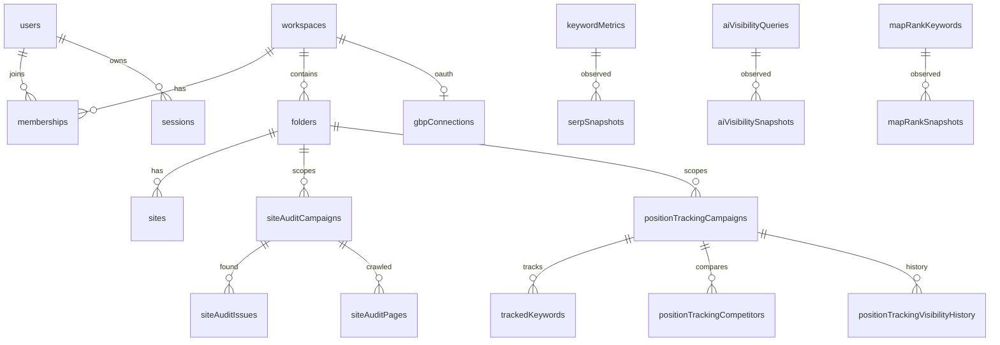

# SEMForge 데이터베이스 설계

2026-07-30 실사 기준. SQLite(`data/app.db`) + Drizzle ORM(better-sqlite3), 마이그레이션 14개(0000~0013), 테이블 39개.

## 원칙

1. **원천/파생 분리** — DB에는 관측된 원천(스냅샷)만 저장한다. Authority Score·KD 같은 파생 지표는 저장하지 않고 `src/lib/analytics/metrics.ts` 순수 함수로 계산한다.
2. **출처(source) 명시** — 수집 데이터 테이블은 `source` 컬럼이 필수다 (`talordata`, `talordata-serp`, `site-audit-crawler` 등). demo 기본값은 0013에서 제거됐다. 리포트 계산은 라이브 소스만 사용한다.
3. **공통 감사 컬럼** — 도메인 테이블은 `auditColumns`(created/updated/soft-delete/낙관적 잠금 `version`)를 공유한다. 활성 행 조건은 `deleted_at IS NULL`.
4. **부분 유니크 인덱스** — 소프트 삭제와 유니크 제약을 함께 쓰기 위해 `WHERE deleted_at IS NULL` 조건부 유니크를 사용한다.
5. **비밀값 보호** — 세션·API 키는 해시만 저장. OAuth 토큰(GSC/GBP)은 `APP_SECRET` 기반 AES-256-GCM으로 at-rest 암호화한다 (`src/lib/crypto.ts`, `enc:v1:` 접두어).
6. **타임스탬프** — ms epoch 정수(`unixepoch() * 1000`). 표시 시점에 로케일 변환.

## ERD (핵심 관계)

`gsc_connections`는 로컬 단일 연결 모델이라 워크스페이스 스코프가 없다(항상 최신 1행 유지).

## 테이블 사전

### 플랫폼 (schema/platform.ts)

| 테이블 | 용도 | 비고 |
|---|---|---|
| workspaces | 테넌트. plan(free/pro/guru/business) 기능 게이트 | slug 유니크 |
| users | 사용자. scrypt 해시+salt | email 유니크 |
| memberships | 사용자-워크스페이스 소속·역할(owner/admin/editor/viewer) | 권한 판정의 단일 출처 |
| sessions | 세션. 토큰은 SHA-256 해시만 | 보존: 만료·폐기 7일 후 정리(db_retention) |
| audit_logs | 엔티티 감사 로그 (before/after 스냅샷, 민감 필드 마스킹) | append-only |

### 도메인 — 폴더/계정 부속 (schema/domain.ts)

| 테이블 | 용도 | 비고 |
|---|---|---|
| folders | 비즈니스 폴더 (도메인 1회 설정, color 팔레트) | (workspace, domain) 부분 유니크 |
| sites | 폴더 하위 도메인/서브도메인 | |
| tags / folder_tags | 폴더 태그 | |
| folder_shares | 폴더 공유(view/edit) | |
| auth_events | 인증 이벤트 로그(login/logout/…) | |
| api_keys | API 키 (해시만 저장, prefix 노출) | |
| notification_settings | 알림 설정 (즉시 저장) | |
| invitations | 멤버 초대 (pending 부분 유니크) | |
| delete_confirmations | 영구 삭제 6자리 확인 코드 | 보존: 소비/만료 1일 후 정리 |

### 도메인 — 툴킷 (schema/domain.ts)

| 테이블 | 용도 | 비고 |
|---|---|---|
| site_audit_campaigns | 사이트 진단 캠페인. schedule(off/daily/weekly/monthly), next_run_at, crawl_meta(robots AI봇 판정 JSON), site_health | due 인덱스 |
| site_audit_issues | 진단 이슈 (severity, 영향 페이지 JSON) | |
| site_audit_pages | 크롤 1회의 페이지 스냅샷 (재실행 시 교체) | 항상 최근 실행 기준 |
| position_tracking_campaigns | 포지션 추적 캠페인. collect_schedule(off/daily/weekly), next_run_at, visibility | due 인덱스 |
| tracked_keywords | 추적 키워드 (position/previousPosition) | |
| position_tracking_competitors | 경쟁사 (캠페인당 ≤5) | |
| position_tracking_visibility_history | 수집 실행별 가시성 이력 | append-only |
| keyword_lists / keyword_list_items | 키워드 목록 | |
| media_lists / media_contacts | 미디어 리스트 | |
| reports / report_schedules | 보고서·예약 | |
| content_articles | 콘텐츠 문서 | |

### 분석 원천 (schema/analytics.ts)

| 테이블 | 용도 | 라이브 소스 | 보존 |
|---|---|---|---|
| keyword_metrics | 지역·기기별 키워드 메타(월 단위) | `talordata-serp` | — |
| serp_snapshots | 키워드별 SERP 순위 스냅샷 (append-only) | `talordata` | 90일(db_retention) |
| clickstream_events | 패널 클릭스트림 | 라이브 소스 없음 (demo 전용, 기본 비어 있음) | — |
| link_graph_edges | 링크 그래프 엣지 | `site-audit-crawler` (자사 크롤 아웃링크) | — |
| backlink_report_caches | Bing/Common Crawl 수신 백링크 개요와 링크된 페이지 | `bing-webmaster`, `common-crawl`, 레거시 `bing-csv` | Bing 24시간, Common Crawl 30일 |
| backlink_list_caches | 링크된 페이지·인바운드 링크 쿼리 캐시 | `bing-webmaster`, `common-crawl`, `bing-csv` | fresh 24시간, 최대 30일 |
| backlink_snapshots | 전환 이후 일별 실제 집계(추이·신규·누락 계산) | Bing/Common Crawl/레거시 CSV | append-only |
| backlink_import_staging | CSV 열 매핑 미리보기 원문 | 사용자 업로드 | 30분 |
| backlink_imported_links | 공급자가 반환한 정규화 인바운드 링크의 물질화 저장소 | `common-crawl`, 레거시 `bing-csv` | 보고서 캐시와 함께 삭제 |

리포트 계산(`src/server/analytics.ts`)은 라이브 소스만 읽는다. 사이트 진단의 `link_graph_edges`와 외부 수신 백링크 캐시는 의미가 달라 섞지 않는다. 전용 백링크 분석 화면은 Bing 인증 사이트를 우선 조회하고 빈 결과는 Common Crawl Web Graph/WARC 역색인으로 보완한다. 기존 `semrush-v4` 및 `bing-csv` 행은 호환 목적으로만 보존하고 신규 기본 흐름에서는 사용하지 않는다.

### 네이버 키워드 인텔리전스 (schema/naver-keywords.ts)

| 테이블 | 용도 | 보존·무결성 |
|---|---|---|
| naver_keyword_snapshots | Search Ads 키워드 검색량·광고 지표 원천 | append-only, fresh 7일·stale 최대 30일 |
| naver_keyword_insights | Search Trend·인구통계·블로그 검색·쇼핑 트렌드 JSON 원천 | kind/schema_version 분리, JSON 유효성 검사 |
| public_keyword_usage | 비로그인 조회 rolling-window 사용량 | HMAC 해시만 저장, 원본 IP·키워드 금지, 만료 후 정리 |
| provider_call_budgets | NAVER 공급자별 전역 일일 호출 카운터 | (provider, budget_date) 유니크 |

검색량의 `<10` 응답은 0으로 치환하지 않는다. 각 기기 값을 `min`, `max_exclusive`, `qualifier`, `display`로 함께 보존하고 합계는 조회 시 범위로 계산한다. `keyword_list_items`의 `provider`, `source_snapshot_id`, `measurement`는 선택 저장 이후에도 원천과 측정 방식(`absolute`, `relative`, `calculated`, `inferred`)을 유지한다. `source_snapshot_id`는 여러 공급자 원천을 가리킬 수 있는 다형 참조라 물리 FK를 두지 않는다.

### AI 가시성 (schema/ai-visibility.ts)

| 테이블 | 용도 | 보존 |
|---|---|---|
| ai_visibility_queries | 도메인별 추적 쿼리 (국가·기기 스코프) | — |
| ai_visibility_snapshots | AIO 출현/인용 관측 (cited: true/false/null=판정불가) | 90일 |

### 지역 (schema/local.ts) · 연결 (schema/connections.ts)

| 테이블 | 용도 | 보존 |
|---|---|---|
| gbp_connections | Google Business Profile OAuth (워크스페이스당 1) | 토큰 암호화 |
| bing_webmaster_connections | Bing Webmaster 읽기 전용 OAuth (워크스페이스당 1) | 토큰 암호화 |
| bing_webmaster_oauth_states | 만료·재사용·워크스페이스 변조 방지 OAuth nonce | 10분, 일회용 |
| map_rank_keywords | 지도 순위 추적 키워드 (사업체명+검색어) | — |
| map_rank_snapshots | 로컬팩 관측 스냅샷 | 90일 |
| gsc_connections | Search Console OAuth (전역 단일 연결) | 토큰 암호화 |

## 마이그레이션 이력과 규약

- 0000~0005: drizzle-kit generate 산출 (스냅샷 있음)
- 0006~0011: 스웜 병렬 작업의 수작업 SQL (스냅샷 없음)
- **0012 `schema_sync`**: 스키마 코드를 실제 DB와 정합화한 뒤 generate로 드리프트 0을 증명하고 no-op 앵커로 남긴 마이그레이션. 이후 generate의 기준 스냅샷.
- 0013: demo source 기본값 제거 (테이블 재생성)

**규약**
1. 스키마 변경은 반드시 `src/db/schema/*` 수정 → `npm run db:generate` → `npm run db:migrate` 순서로 한다. 수작업 SQL 마이그레이션은 스냅샷 드리프트를 만들므로 금지.
2. `src/db/migrate.ts`는 `foreign_keys = OFF`로 실행한다. drizzle의 테이블 재생성 마이그레이션은 SQL 안의 `PRAGMA foreign_keys=OFF`가 트랜잭션 내 no-op이라, FK를 켠 채 실행하면 참조 테이블 DROP 시 ON DELETE CASCADE로 자식 행이 소실된다 (0013에서 실제 발생 — serp_snapshots 손실 후 재수집 복구).
3. 재생성 마이그레이션 적용 전에는 `npm run db:backup`을 권장한다.

## 운영 스크립트

| 명령 | 동작 |
|---|---|
| `npm run db:migrate` | 마이그레이션 적용 |
| `npm run db:generate` | 스키마 diff 마이그레이션 생성 |
| `npm run db:backup` | `VACUUM INTO`로 일관 백업 → `data/backups/` |
| `npm run db:cleanup:demo` | demo 소스 행 선별 삭제 + VACUUM (실측 보존) |
| `npm run db:seed` | 구조 시드 (`SEED_DEMO_DATA=1`일 때만 데모 지표 포함) |
| cron `GET /api/cron/run-due` | due 잡 실행: `site_audit`, `position-tracking-collect-due`, `db_retention` |

## 엔진 판단: SQLite 유지, PostgreSQL 이행 기준

현 워크로드(로컬 단일 프로세스·단일 사용자, ~수 MB, 쓰기는 수집 배치 위주)에는 **SQLite + WAL이 최적**이다 — 운영 비용 0, `busy_timeout=5000`, better-sqlite3 동기 API로 레이스 없음, 백업 단순.

다음 신호가 나타나면 PostgreSQL 이행을 검토한다. Drizzle을 쓰고 있어 이행 비용은 dialect 재선언 + 마이그레이션 재생성 수준이다.

1. 다중 인스턴스/서버 배포가 필요할 때 (SQLite 파일 공유 불가)
2. 동시 쓰기 경합으로 `SQLITE_BUSY`가 빈발할 때
3. DB가 상시 100MB+ 로 성장하고 분석 쿼리가 느려질 때 (또는 스냅샷 보존 기간을 크게 늘려야 할 때)
## Marketing Intelligence 제어/분석 분리

Airbyte 연동 이후에도 SQLite는 운영·제어 데이터만 보관한다. `marketing_connections`, `marketing_property_bindings`, `marketing_oauth_states`, `marketing_sync_runs`, `marketing_report_snapshots`, `marketing_entity_bindings`가 워크스페이스 권한과 외부 ID 매핑을 담당한다. OAuth token, Airbyte `secretId`, CRM 원본 PII는 이 DB에 저장하지 않는다.

대용량 사실·마트는 별도 Postgres `marketing` schema에 둔다. `AIRBYTE_DESTINATION_DATABASE_URL`은 raw 전용 writer, `ANALYTICS_TRANSFORM_DATABASE_URL`은 raw 읽기·정리 및 fact/mart 쓰기 전용 transformer, 앱의 `ANALYTICS_DATABASE_URL`은 mart SELECT 전용 reader 자격증명이다. 앱은 `mart_page_funnel_daily`, `mart_channel_roi_daily`, `mart_campaign_performance_daily`, `mart_content_performance`, `mart_attribution`만 읽으며 Airbyte raw schema에는 권한을 갖지 않는다. 일반 raw는 30일, HubSpot PII raw는 7일, sync log는 90일, canonical fact는 25개월 보존을 적용한다.
