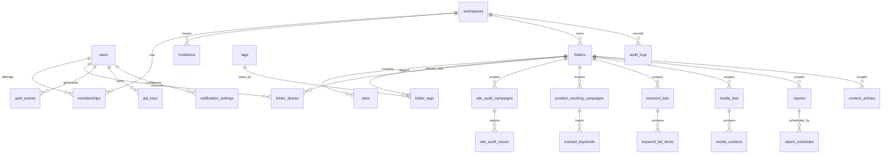

# 재구축 명세서 — Semrush 앱 CRUD 클론

> 근거: `APP_CRUD_EVIDENCE.md` (2026-07-28 실측)
> 표기: `O` 직접 관찰 / `I1` 강한 추론 / `I2` 약한 가정 / `U` 확인 불가 / `P` 안전한 재구축을 위한 제안
> 시간대: 저장은 UTC epoch(ms), 표시는 `Asia/Seoul`
> 화면 언어: 한국어

---

## 1. 정보 구조와 사이트맵

```
/login/                        로그인 (P: 원본은 SSO·소셜 로그인 포함)
/signup/                       가입 (P)
/app/home/                     폴더 목록 (O 기반)
/app/folders/[id]/             폴더 상세 + 웹사이트 목록 (P: 원본은 폴더별 툴킷 딥링크)
/app/trash/                    휴지통 (P: 원본에 없음)
/app/audit/                    엔티티 감사 로그 (P: 원본 활동 로그는 인증 전용)
/app/account/profile/          프로필 설정 (O)
/app/account/members/          사용자 관리 (O 부분)
/app/account/notifications/    알림 설정 (O)
/app/account/activities/       인증 활동 로그 (O)
/app/account/api-keys/         API 키 (O)
/app/siteaudit/                사이트 감사 캠페인 (P)
/app/position-tracking/        순위 추적 캠페인 (P)
/app/keyword-lists/            키워드 목록 (P)
/app/media-lists/              미디어 리스트 (P)
/app/reports/                  보고서 (P)
/app/content/                  콘텐츠 문서 (P)
```

원본과 다른 점: 원본은 툴킷 경로가 최상위(`/siteaudit/` 등)이고 폴더 컨텍스트를 `?fid=` 쿼리로 전달한다. 재구축에서는 기존 정적 클론 라우트(`/siteaudit/` 등)와 충돌하지 않도록 CRUD 앱을 `/app/*` 아래에 두고, 폴더 컨텍스트는 동일하게 `?fid=`로 유지한다.

---

## 2. 사용자 역할 및 권한표

원본에서 확인된 것: 소유자와 "관리자에게 사용자 관리 작업을 할당" 문구뿐 (`I1`). 구체적 역할명·권한 매트릭스는 `U`.
아래는 **제안(P)** 이다.

| 권한 | viewer | editor | admin | owner |
|---|:--:|:--:|:--:|:--:|
| 목록·상세 조회 | O | O | O | O |
| 내보내기(CSV) | O | O | O | O |
| 생성 | – | O | O | O |
| 수정(본인 소유) | – | O | O | O |
| 수정(타인 소유) | – | – | O | O |
| 소프트 삭제(본인 소유) | – | O | O | O |
| 소프트 삭제(타인 소유) | – | – | O | O |
| 휴지통 복구 | – | O(본인) | O | O |
| **영구 삭제(purge)** | – | – | O | O |
| 멤버 초대·역할 변경 | – | – | O | O |
| 엔티티 감사 로그 조회 | – | – | O | O |
| 워크스페이스 설정 | – | – | – | O |

강제 지점: 모든 변경 API가 `src/lib/rbac.ts`의 `assertCan` / `assertOwnershipOrAdmin` / `assertSameWorkspace`를 통과한다. 프론트엔드의 버튼 숨김은 UX 보조일 뿐 권한 판정 근거가 아니다.

---

## 3. 엔티티 관계도



`folders` 가 모든 도메인의 테넌트 하위 스코프 축이라는 점은 원본 URL 규약(`?fid=` 전파)에서 관찰된 사실(`O`)에 근거한다.

---

## 4. 필드 정의서

### 4.1 folders (`O` 중심)

| 필드 | 타입 | 필수 | 수정 | 근거 | 규칙 |
|---|---|:--:|:--:|---|---|
| `id` | text(ULID) | 자동 | – | `P` | 원본은 숫자 `fid` |
| `workspaceId` | text FK | 자동 | – | `P` | 테넌트 분리 |
| `name` | text | 필수 | 가능 | `O` | 원본 라벨 "비즈니스명", 1~100자 |
| `domain` | text | 필수(생성) | **불가** | `O` R1/R2 | 도메인 형식 검증, 워크스페이스 내 유일 |
| `shareOnReportCreate` | boolean | 선택 | 가능 | `O` | 원본 "보고서가 생성되면 공유하기" / "저장 후 공유하기" |
| `pinned` | boolean | 선택 | 가능 | `O`(메뉴 존재) | 목록 상단 고정 |
| `createdBy`/`updatedBy` | text | 자동 | – | `P` | 소유권 판정 |
| `deletedAt`/`deletedBy` | ts/text | – | – | `P` | 소프트 삭제 |
| `version` | integer | 자동 | – | `P` | 낙관적 잠금 |

도메인 형식 검증 (원본 메시지 재사용): 실패 시 `"올바른 웹사이트를 입력하세요."` (`O`)

### 4.2 sites (`O`)

| 필드 | 타입 | 필수 | 근거 | 규칙 |
|---|---|:--:|---|---|
| `folderId` | text FK | 필수 | `O` | 폴더 하위 |
| `domain` | text | 필수 | `O` | placeholder "도메인 또는 서브도메인 입력", 폴더 내 유일 |
| `isPrimary` | boolean | – | `I2` | 폴더 대표 도메인 |

### 4.3 tags / folder_tags (`I1`)

UI에 `태그` 메뉴와 태그 필터가 존재하나 내용은 `U`. 이름(1~30자) + 색상, 워크스페이스 내 이름 유일로 제안(`P`).

### 4.4 folder_shares (`I1`)

소유권 필터 옵션 `내 소유` / `나에게 공유된 캠페인`(`O`)에 근거. `folderId` + `userId` + `permission(view|edit)`.

### 4.5 auth_events (활동 로그, `O`)

| 필드 | 근거 |
|---|---|
| `occurredAt` | `O` 컬럼 "날짜 및 시간" |
| `eventType` | `O` 관찰값 `login`, `registration` + `P` 확장 `login_failed`, `logout`, `password_change` |
| `ip`, `country`, `userAgent` | `O` |

정렬 가능(`O`), 페이지네이션 `?page=`(`O`).

### 4.6 api_keys (`O`)

| 필드 | 근거 |
|---|---|
| `keyPrefix`(표시용), `hashedKey` | `O` 컬럼 `Key` / `P` 해시 보관 |
| `permissions` | `O` 컬럼 |
| `version` | `O` 컬럼 |
| `createdAt`, `expiresAt` | `O` 컬럼 |
| `status` = `active` \| `inactive` | `O` 탭 |

### 4.7 6개 툴킷 도메인 (전부 `P`, 진입점만 `O`)

| 테이블 | 관찰된 근거 필드 | 제안 필드 |
|---|---|---|
| `site_audit_campaigns` | 크롤링 범위·페이지 제한·크롤링 소스·프로젝트 이름·예약 주기 (랜딩 안내문 `I1`) | `name`, `domain`, `crawlScope`, `pageLimit`, `crawlSource`, `schedule`, `status`, `siteHealth` |
| `site_audit_issues` | 심각도 라벨링 (`I1`) | `severity(error/warning/notice)`, `title`, `count`, `status` |
| `position_tracking_campaigns` | 도메인 입력 + 위치/기기/검색엔진 (`O` 랜딩 문구) | `name`, `domain`, `location`, `device`, `searchEngine`, `status` |
| `tracked_keywords` | 키워드·포지션·SOV (`I1`) | `keyword`, `position`, `previousPosition`, `volume`, `difficulty` |
| `keyword_lists` | 모드 `도메인 기반`/`시드 키워드 기반`/`수동`, DB 선택 `US` (`O`) | `name`, `mode`, `database`, `seed`, `status` |
| `keyword_list_items` | — | `keyword`, `volume`, `difficulty`, `intent`, `cluster` |
| `media_lists` | 기자/매체 세그먼트 (`O` 랜딩 문구) | `name`, `description`, `contactCount` |
| `media_contacts` | 기자 프로필·비트·매체 (`O` 랜딩 문구) | `name`, `outlet`, `beat`, `email`, `country` |
| `reports` | 템플릿(브랜드 성과/GA4/GSC), 위젯 200+, 자동 일정, 화이트라벨 (`O`) | `name`, `template`, `theme`, `status`, `widgetCount` |
| `report_schedules` | "보고서 생성을 자동화하여 일정에 맞게 실행" (`O`) | `frequency`, `dayOfMonth`, `recipients`, `nextRunAt` |
| `content_articles` | 생성/최적화/재활용 3모드, 내 콘텐츠 목록 (`O`) | `title`, `mode`, `status`, `keyword`, `wordCount`, `seoScore` |

---

## 5. CRUD 매트릭스

| 엔티티 | Create | Read | Update | Delete | Restore | Bulk | 근거 | 신뢰도 |
|---|---|---|---|---|---|---|---|---|
| Folder | 관찰 | 관찰 | 관찰 | 관찰(코드 확인) | **없음** | **없음** | 다이얼로그·목록·확인창 실측 | `O` |
| Site | 관찰(다이얼로그) | 관찰(폴더 행) | 미확인 | 미확인 | 미확인 | 미확인 | `웹사이트 추가` 폼 | `O`/`U` |
| Tag | 미확인 | 관찰(필터 존재) | 미확인 | 미확인 | – | – | 메뉴·필터 존재 | `I1` |
| FolderShare | 미확인 | 관찰(소유권 필터) | 미확인 | 미확인 | – | – | 필터 옵션 | `I1` |
| User(프로필) | – | 관찰 | 관찰 | 미확인 | – | – | 프로필 폼 | `O` |
| Membership | 미확인(초대 버튼 비활성) | 미확인 | 미확인 | 미확인 | – | – | 버튼만 존재 | `U` |
| AuthEvent | 시스템 | 관찰 | – | – | – | – | 활동 로그 표 | `O` |
| QueryLog | 시스템 | 관찰 | – | – | – | 내보내기 관찰 | 쿼리 로그 | `O` |
| ApiKey | 관찰(버튼) | 관찰(표·탭) | 미확인 | 미확인(Inactive 전이 추정) | – | – | 목록·탭 | `O`/`I1` |
| NotificationSetting | – | 관찰 | 관찰(즉시 저장) | – | – | – | 체크박스 | `O` |
| 6개 툴킷 엔티티 | 진입점만 관찰 | 미확인 | 미확인 | 미확인 | 미확인 | 미확인 | 랜딩 게이트 | `O`(진입점) / `U`(내부) |

**누락으로 표시하고 새 제품에서 제안하는 기능**

| 기능 | 원본 관찰 | 재구축 제안 |
|---|---|---|
| 소프트 삭제 + 휴지통 | 없음 (`I1` 하드 삭제) | **추가**(P). 기본 삭제는 휴지통 이동 |
| 복구 | 없음 | **추가**(P) |
| 영구 삭제 분리 | 폴더 삭제가 곧 영구 삭제 | **추가**(P). admin 이상 + 코드 확인 |
| 일괄 선택·일괄 작업 | 없음(체크박스 부재) | **추가**(P). 일괄 삭제/복구/태그 |
| 엔티티 변경 감사 로그 | 없음(인증 전용) | **추가**(P). before/after 스냅샷 |
| 동시 수정 충돌 처리 | 미관찰 | **추가**(P). `version` 낙관적 잠금 → 409 |
| 성공 알림 | 토스트 없음 | **추가**(P). `aria-live` 상태 메시지 |
| 검색 결과 없음 상태 | 미관찰 | **추가**(P) |

---

## 6. 상태 전이표

### 6.1 소프트 삭제 라이프사이클 (모든 사용자 생성 엔티티, `P`)

| 현재 | 이벤트 | 다음 | 권한 | 부가 조건 |
|---|---|---|---|---|
| `active` | `DELETE` | `trashed` | editor(본인)/admin | 단순 확인 |
| `trashed` | `POST /restore` | `active` | editor(본인)/admin | 유일성 재검사 통과 |
| `trashed` | `DELETE ?purge=1` | (없음) | admin+ | 6자리 코드 확인 |
| `active` | `PATCH` | `active` | editor(본인)/admin | `version` 일치 |
| `trashed` | `PATCH` | 거부 409 | – | 휴지통 항목은 수정 불가 |

### 6.2 API 키 (`O` 관찰 구조 유지)

| 현재 | 이벤트 | 다음 |
|---|---|---|
| `active` | 폐기 | `inactive` |
| `active` | 만료 시각 도달 | `inactive` |
| `inactive` | 영구 삭제 | (없음, admin+) |

### 6.3 사이트 감사 캠페인 (`P`)

`idle → queued → running → completed` / `running → failed → queued(재시도)`

### 6.4 초대 (`P`)

`pending → accepted` / `pending → expired(7일)` / `pending → revoked`

---

## 7. API 목록

공통 규약
- 성공: `{ "data": ..., "meta"?: ... }` / 실패: `{ "error": { "code", "message", "fields"?, "details"? } }`
- 목록 쿼리: `?q=&page=&pageSize=&sort=<field>:<asc|desc>&scope=<active|trashed|all>&<filter>=<v1,v2>`
- `trailingSlash: true` 설정 때문에 모든 API 경로는 **후행 슬래시**로 호출한다.
- 오류 코드 → HTTP: `VALIDATION_ERROR` 400, `UNAUTHENTICATED` 401, `PLAN_LIMIT` 402, `FORBIDDEN` 403, `NOT_FOUND` 404, `DUPLICATE`/`VERSION_CONFLICT`/`RELATION_RESTRICT` 409, `RATE_LIMITED` 429, `INTERNAL` 500

| 메서드 | 경로 | 설명 | 최소 권한 |
|---|---|---|---|
| POST | `/api/auth/login/` | 로그인, 세션 쿠키 발급, `auth_events` 기록 | – |
| POST | `/api/auth/logout/` | 세션 폐기 | 로그인 |
| GET | `/api/auth/me/` | 현재 사용자·워크스페이스·역할 | 로그인 |
| POST | `/api/auth/workspace/` | 활성 워크스페이스 전환 | 로그인 |
| GET/POST | `/api/folders/` | 폴더 목록(검색·필터·정렬·페이지)/생성 | viewer / editor |
| GET/PATCH/DELETE | `/api/folders/[id]/` | 상세/수정/삭제(`?purge=1`) | viewer / editor / editor(admin for purge) |
| POST | `/api/folders/[id]/restore/` | 휴지통 복구 | editor |
| GET/POST | `/api/folders/[id]/sites/` | 폴더의 웹사이트 목록/추가 | viewer / editor |
| DELETE | `/api/sites/[id]/` | 웹사이트 삭제 | editor |
| POST | `/api/folders/bulk/` | 일괄 삭제·복구·태그(P) | editor |
| GET/POST | `/api/tags/` | 태그 목록/생성 | viewer / editor |
| GET/POST | `/api/members/` | 멤버 목록/초대 | admin |
| PATCH/DELETE | `/api/members/[id]/` | 역할 변경/제거 | admin |
| GET | `/api/audit/` | 엔티티 감사 로그 | admin |
| GET | `/api/activities/` | 인증 활동 로그 | 본인 |
| GET/PATCH | `/api/notifications/` | 알림 설정 조회/토글 | 본인 |
| GET/POST | `/api/api-keys/` | 키 목록(`?status=`)/생성 | 본인 |
| PATCH/DELETE | `/api/api-keys/[id]/` | 폐기/영구 삭제 | 본인 / admin |
| GET/POST | `/api/site-audits/` 외 5종 | 6개 툴킷 도메인 CRUD (동일 규약) | viewer / editor |
| GET | `/api/{resource}/export/` | CSV 내보내기 | viewer |

---

## 8. 입력 검증 규칙

| 필드 | 규칙 | 실패 메시지 | 근거 |
|---|---|---|---|
| 폴더 이름 | 필수, 1~100자, 공백 트림 | `비즈니스명을 입력하세요.` | `O`(필수) / `P`(길이) |
| 도메인 | 필수, 도메인/서브도메인 형식, 소문자 정규화, 스킴·경로 제거 | `올바른 웹사이트를 입력하세요.` | `O`(문구 그대로) |
| 도메인 중복 | 워크스페이스 내 활성 폴더에서 유일 | `이미 등록된 웹사이트입니다.` | `P` |
| 태그 이름 | 필수, 1~30자, 워크스페이스 내 유일 | `이미 존재하는 태그입니다.` | `P` |
| 이메일 | RFC 형식, 소문자 정규화, 유일 | `이미 사용 중인 이메일입니다.` | `P` |
| 비밀번호 | 8자 이상 | `비밀번호는 8자 이상이어야 합니다.` | `P` |
| 페이지 크기 | 1~100 | `pageSize는 100 이하여야 합니다.` | `P` |
| 정렬 필드 | 허용 목록 | `정렬할 수 없는 필드입니다: <f>` | `P` |
| 삭제 확인 코드 | 서버 발급 6자리와 일치 | `확인 코드가 일치하지 않습니다.` | `O`(원본 코드 확인 방식) |

클라이언트와 서버가 동일한 zod 스키마를 공유하고, 서버 검증이 최종 판정이다.

---

## 9. 삭제 및 복구 정책 (`P` — 원본과 의도적으로 다름)

1. 기본 `DELETE`는 **소프트 삭제**: `deletedAt`/`deletedBy` 기록, 목록에서 제외.
2. `/app/trash/`에서 `scope=trashed`로 조회하고 복구 가능. 복구 시 유일성(도메인·태그명) 재검사 후 충돌이면 409.
3. 영구 삭제는 `DELETE ?purge=1` + **admin 이상** + 6자리 코드 확인. 원본 폴더 삭제의 코드 확인 UX를 이 경로로 이전한다.
4. 관계 데이터: 폴더 소프트 삭제 시 하위 사이트·캠페인도 함께 `trashed`(연쇄 소프트 삭제), 복구 시 함께 복구. 영구 삭제는 FK `ON DELETE CASCADE`.
5. 참조가 남아 있어 지울 수 없는 경우(예: 태그가 폴더에 사용 중) `RELATION_RESTRICT` 409 + 사용 건수 안내.
6. 원본의 경고 문구("이 폴더 및 연결된 모든 데이터가 삭제됩니다" + 영향 도구 목록)는 **영구 삭제 확인 다이얼로그**에 유지한다.

---

## 10. 오류 처리 정책

| 상황 | 응답 | 화면 |
|---|---|---|
| 미인증 | 401 `UNAUTHENTICATED` | 로그인으로 이동 |
| 타 워크스페이스/존재하지 않음 | **둘 다 404** `NOT_FOUND` | "찾을 수 없습니다" 빈 화면 (원본은 랜딩 폴백 `O`, 재구축은 명시적 404) |
| 역할 부족 | 403 `FORBIDDEN` (필요 역할 안내) | 인라인 경고 + 액션 비활성 |
| 플랜 게이트 | 402 `PLAN_LIMIT` | 업그레이드 게이트 카드 (원본 게이트 UX 재현) |
| 유일성 위반 | 409 `DUPLICATE` | 해당 필드 인라인 오류 |
| 버전 충돌 | 409 `VERSION_CONFLICT` | "다른 사용자가 먼저 수정했습니다. 새로고침 후 다시 시도하세요." + 현재값 보기 |
| 입력 오류 | 400 + `fields` | 필드별 인라인 메시지 + `aria-invalid` |
| 서버 예외 | 500, 내부 메시지 비노출 | 재시도 버튼 |

SQLite 제약 위반(`UNIQUE`, `FOREIGN KEY`)은 `src/lib/api.ts`의 `route()` 래퍼가 각각 `DUPLICATE`/`RELATION_RESTRICT`로 변환한다.

---

## 11. 감사 로그 정책 (`P`)

원본은 인증 이벤트만 노출하므로(`O`), 재구축은 두 계층으로 분리한다.

| 계층 | 대상 | 화면 | 열람 권한 |
|---|---|---|---|
| `auth_events` | login / login_failed / logout / registration | `/app/account/activities/` | 본인 |
| `audit_logs` | create / update / delete / restore / purge / bulk_* / export / permission_denied | `/app/audit/` | admin 이상 |

`audit_logs` 기록 항목: 워크스페이스, 행위자(id·email), 액션, 엔티티 타입·ID·표시명(삭제 후에도 읽을 수 있도록 비정규화), before/after JSON, IP, User-Agent, 시각.
`password`, `passwordHash`, `token`, `apiKey`, `secret` 키는 저장 전에 `[redacted]`로 마스킹한다. 감사 기록 실패는 본 작업을 롤백하지 않는다.

---

## 12. 화면별 기능 명세 (핵심 화면)

### 12.1 `/app/home/` 폴더 목록

- 헤더: 섹션 타이틀 `폴더`, `필터 숨기기 및 보기 전환`, 우측 `공유`·`+ 폴더 만들기` (원본 배치 `O`)
- 필터 행: 검색(placeholder `웹사이트 또는 폴더 이름`), `소유권`(전체/내 소유/나에게 공유됨), `태그`, `테이블 보기(SEO 전용)` 스위치 — 모두 URL 쿼리에 동기화
- 카드 보기: 폴더명(링크) + 도메인 + kebab, 도메인 없으면 `웹사이트 추가` + 안내문, 있으면 지표 셀
- 테이블 보기 컬럼: `폴더` / `Site Health` / `가시성` / `유해한 도메인` / `실행할 아이디어` / `백링크 잠재 도메인` / `자연 세션` (원본 `O`) + 정렬 토글
- kebab 메뉴: `공유` / `핀 고정` / `태그` / `설정` / (구분선) / `삭제` (원본 순서·구분선 `O`)
- 상태: 기본 / 로딩(`데이터 로드 중`) / 빈 상태 / **검색 결과 없음(P)** / 오류 / 권한 없음(P)
- 추가(P): 행 체크박스와 일괄 작업 바, 휴지통 링크

### 12.2 폴더 만들기 / 설정 다이얼로그

원본 필드·라벨·버튼을 그대로 재현하고, 도메인은 수정 시 읽기 전용 텍스트로 전환한다(`O` R1).

### 12.3 삭제 다이얼로그

- 소프트 삭제(기본): 제목 `폴더를 휴지통으로 이동`, 단순 확인 (`P`)
- 영구 삭제(admin): 원본 문구 + 영향 도구 목록 + **랜덤 6자리 코드 입력**(`O` 재현)

### 12.4 `/app/trash/` 휴지통 (P)

엔티티 타입 필터, 삭제 시각·삭제자 표시, 개별/일괄 복구, 개별/일괄 영구 삭제(코드 확인).

### 12.5 `/app/audit/` 감사 로그 (P)

컬럼: 시각(Asia/Seoul) / 행위자 / 액션 / 엔티티 / 대상명 / IP. 필터: 액션·엔티티 타입·기간. before/after diff 펼치기.

---

## 13. 원본과 달라지는 점 요약

| # | 원본(관찰) | 재구축 | 이유 |
|---|---|---|---|
| 1 | 폴더 삭제 = 즉시 영구 삭제, 복구 없음 | 소프트 삭제 + 휴지통 + 관리자 영구 삭제 | 데이터 손실 방지 |
| 2 | 활동 로그 = 인증 이벤트만 | 인증 로그 + 엔티티 감사 로그 분리 | 변경 추적 |
| 3 | 성공 토스트 없음 | `aria-live` 성공 메시지 | 접근성 |
| 4 | 잘못된 `fid` → 랜딩 폴백 | 명시적 404 화면 | 디버깅 가능성 |
| 5 | 일괄 작업 없음 | 일괄 삭제·복구·태그 | 운영 효율 |
| 6 | 동시 수정 충돌 미확인 | `version` 낙관적 잠금 409 | 데이터 정합성 |
| 7 | 6개 툴킷 = 플랜 게이트 | 시드 데이터로 동작하는 CRUD(P) | 검증 가능한 산출물 |
| 8 | 페이지네이션 파라미터 불일치(`page` vs `pageNumber`) | 전 화면 `page`로 통일 | 일관성 |
| 9 | 실제 데이터 지표(AI 가시성 등) | 결정적 시드 값 | 외부 데이터 의존 제거 |
